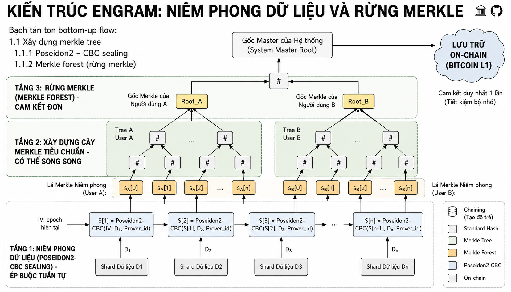

# Giao thức chứng minh lưu trữ trong Engram
***Mục tiêu: Chuyển đổi cơ chế chứng minh lưu trữ hiện tại để phù hợp với những máy tính có cấu hình thấp hơn.***

## Tổng quan hệ thống
Hệ thống được chia thành 6 layers:
```
1. Prover (Storage node): Thực hiện thuật toán VDF (chứng minh thời gian lưu trữ) + tạo bằng chứng chứng minh lưu trữ dựa vào (folding scheme + Spartan) và sử dụng poseidon2 để tối ưu hóa cho RAM của máy tính
2. Layer 2: Lớp thuật toán xác minh bằng chứng
3. Lớp 3: Lớp các node được ủy quyền xác minh
4. Lớp 4: Lớp smart contract optimistic lên ethereum
5. Lớp 5: Bitcoin L1: Lớp lưu trữ meta data lâu dài
```

Note: A separate genesis setup (Layer 0) lives under `Layers_of_PoSt/Layer_0_genesis_setup` and simulates generation and distribution of public parameters (verifier keys / public params). Layers 1 and 2 read those parameters produced by Layer 0.

---
## 1. Lớp 1: Prover
**Mục tiêu**: Tạo bằng chứng chứng minh lưu trữ dữ liệu trong khoảng thời gian cố định
**Yêu cầu về cơ chế**: Cơ chế phải được tinh chỉnh sao cho yêu cầu về phần cứng của Prover không quá lớn.
**Đơn dữ liệu**: Dữ liệu được tổ chức với đơn vị nhỏ nhất là shard
## 💻 Yêu cầu Phần cứng (Hardware Requirements)

Kiến trúc Engram được thiết kế để hoạt động tối ưu trên các thiết bị cá nhân phổ thông bằng cách tách rời dung lượng dữ liệu khỏi yêu cầu bộ nhớ (RAM) và vô hiệu hóa lợi thế của xử lý song song.

| Linh kiện | Thông số Khuyến nghị | Chi tiết Kỹ thuật |
|:---|:---|:---|
| **RAM** | **8 GB** (Tiêu thụ thực tế ~2 GB) | Sử dụng hằng số bộ nhớ thấp nhờ Folding Scheme (Nova). |
| **CPU** | **Intel i5+ / Ryzen 5+ / Apple M1+** | Ưu tiên hiệu năng đơn luồng (Single-thread) cho VDF tuần tự. |
| **GPU** | **Không yêu cầu** (Integrated GPU) | Cơ chế chống song song hóa vô hiệu hóa lợi thế của GPU. |
| **Ổ cứng (Storage)** | **512 GB SSD** (Chuẩn NVMe) | Tối ưu hóa I/O cho việc đọc Shard dữ liệu thô. |
| **Mạng (Network)** | **Băng thông > 50 Mbps** | Chỉ cần truyền tải Proof gọn nhẹ (vài chục KB). |

> **💡 Đặc điểm cốt lõi:** Hệ thống ưu tiên sự công bằng phần cứng (Hardware Fairness).

### 1.1 Xây dựng merkle tree
**Tổng quan**: Prover phải xây dựng cây merkle tree để chứng minh lưu trữ trong thời gian cố định, và các node kiểm chứng sẽ so sánh bằng chứng ấy với merkle root mà prover đã commit trước đó để xác minh bằng chứng hợp lệ
**Mục tiêu**: Cây merkle tree được xây dựng ***đúng 1 lần mỗi khi Prover tiếp nhận yêu cầu lưu trữ từ khách hàng***. Và phải đảm bảo cây merkle tree ***không thể bị xóa đi trong quá trình Prover lưu trữ dữ liệu***.
Để đảm bảo 2 yêu cầu trên, cây merkle tree phải được thiết kế sao cho:
- Thời gian tạo merkle tree là đủ lâu với bất kì phần cứng nào, lâu tới mức Prover gian lận sẽ ***không thể nộp bằng chứng đúng hạn***. 
- Các Prover với cấu hình tối thiểu (như đã được đề xuất) có thể tạo merkle tree.
#### 1.1.1 Poseidon2 - CBC sealing
Để đảm bảo cây merkle tree được xây dựng với 2 yêu cầu trên, em đề xuất thuật toán băm Poseion2 - CBC sealing.
```
S[1] = Poseidon2(Data[1], Prover_ID, IV)
S[n]= Poseidon2(S[n-1],Data[n], Prover_ID)
```
Trong đó:
```IV```: Initial Vector: (giá tị IV nên là epoch hiện tại) với mục đích là nếu một Prover được yêu cầu phải lưu trữ 2 bản copy thì Merkle tree sinh ra từ 2 yêu cầu đó phải khác nhau (tránh việc Prover chỉ lưu trữ 1 bản)

> Lưu ý: Thuật toán băm này sẽ được áp dụng cho tầng lá của cây merkle tree, còn đối với tầng cao hơn, thì cây merkle tree sẽ được xây dựng như bình thường

#### 1.1.2 Merkle forest (rừng merkle)
**Mục tiêu**: mỗi một prover sẽ nên và chỉ nên commit một cam kết duy nhất lên trên chuỗi để tiết kiệm bộ nhớ onchain.

### 1.2 Challange (thử thách của chuỗi)
**Mục tiêu**: Thử thách này có thể hoàn thành được khi và chỉ khi node đấy không gian lận và node đấy đạt đủ yêu cầu cấu hình tối thiểu.
#### 1.2.1 Nguồn sinh thử thách (challange seed)
**Yêu cầu**: Nguồn sinh thử thách phải là ngẫu nhiên để tránh prover gian lận.
- **Sử dụng Bitcoin L1 làm Beacon**: Cứ mỗi đầu Epoch (ví dụ: mỗi 1 giờ), hệ thống sẽ lấy Mã băm của Block Bitcoin mới nhất (Block Hash) kết hợp với ID của Prover để làm Hạt giống ngẫu nhiên (Seed).
- **Ánh xạ Shard**: Hạt giống này sẽ được đưa vào một Hàm giả ngẫu nhiên (PRNG). Đầu ra của hàm này sẽ chỉ định chính xác N chỉ số ngẫu nhiên (Ví dụ: Shard số 15, Shard số 9.023, Shard số 45.112) mà Prover bắt buộc phải chứng minh trong Epoch này.
- **Ánh xạ Shard**: Hạt giống này sẽ được đưa vào một Hàm giả ngẫu nhiên (PRNG). Đầu ra của hàm này sẽ chỉ định chính xác N chỉ số ngẫu nhiên (Ví dụ: Shard số 15, Shard số 9.023, Shard số 45.112) mà Prover bắt buộc phải chứng minh trong Epoch này.
#### 1.2.2 Cơ chế Lấy mẫu Xác suất (Probabilistic Sampling)
**Yêu cầu**: Cơ chế sinh thử thách phải tránh việc kiểm tra toàn bộ prover để tiết kiệm chi phí tính toán nhưng cũng phải đảm bảo prover sẽ không thể gian lận.

- Thay vì kiểm tra 100%, Thử thách chỉ yêu cầu Prover lấy ra một số lượng nhỏ (ví dụ N = 100 Shards) để kiểm tra.
- Logic bảo mật: Nếu Prover lén xóa đi 10% dữ liệu để tiết kiệm ổ cứng, xác suất để Prover "vượt qua" bài kiểm tra ngẫu nhiên 100 Shards mà không trúng vào phần đã xóa là: (1 - 0.1)^100 ≈ 0.0026%. 
Nghĩa là, chỉ cần Prover xóa một phần rất nhỏ dữ liệu, họ gần như chắc chắn 99.99% sẽ bị bắt quả tang và bị phạt (Slash).

#### 1.2.3 Luồng Chứng minh Lưu trữ Liên tục (PoSt Flow)
Khi nhận được Thử thách yêu cầu kiểm tra Shard thứ i, Prover sẽ thực hiện các bước sau (và đưa vào mạch ZK để gập):

- **Truy xuất dữ liệu**: Prover truy xuất từ ổ cứng các mảnh dữ liệu cần thiết cho bước i bao gồm: Dữ liệu gốc (D_i), mã băm của khối liền trước (S_{i-1}), lá Merkle hiện tại (S_i) và Đường dẫn Merkle (Merkle Path) của lá thứ i.
- **Giải quyết Ràng buộc Mạch (Circuit Constraints)**: Tại mỗi bước gập (Fold), mạch m_aug sẽ đánh giá đồng thời 2 điều kiện bắt buộc (Constraints) sau:
    - **Ràng buộc Tri thức (Chứng minh tính toàn vẹn của dữ liệu)**: Mạch kiểm tra tính hợp lệ của phương trình niêm phong:

Poseidon2(S_{i-1}, D_i, Prover_ID) == S_i (với i > 1)

hoặc 

Poseidon2(IV, D_1, Prover_ID) == S_1 (với i = 1)

(Điều này ép buộc Prover phải cung cấp đúng D_i làm Private Input, chứng minh họ không xóa dữ liệu gốc).
    - **Ràng buộc Vị trí (Chứng minh sự tồn tại của S_i)**: Mạch sử dụng S_i kết hợp với Merkle Path để băm tuần tự lên trên. Kết quả cuối cùng phải khớp hoàn toàn với Master Merkle Root mà Prover đã cam kết (commit) trên chuỗi từ trước.
- Tổng hợp Bằng chứng: Thay vì tạo ra N bằng chứng rời rạc, quá trình tổng hợp được chia làm 2 giai đoạn để tối ưu hóa hiệu năng:
    - **Giai đoạn Gập (Nova Folding)**: Prover sử dụng thuật toán Nova để gập (fold) liên tiếp N bước kiểm tra trạng thái lại với nhau. Kết quả của quá trình này tạo ra một Trạng thái Gập cuối cùng (Final Folded Instance) duy nhất đại diện cho toàn bộ N bước kiểm tra.
    - **Giai đoạn Nén (Spartan Wrapper)**: Sau khi xác minh việc gập nội bộ thành công, Prover sử dụng thuật toán chứng minh ZK-SNARK (cụ thể là Spartan) làm lớp bọc ngoài (Wrapper). Spartan sẽ biên dịch Trạng thái Gập cuối cùng thành một bằng chứng siêu nén (chỉ vài chục KB) với thời gian kiểm chứng hằng số O(1).
    - **Đệ trình (Submission)**: Bằng chứng Spartan tối hậu này sau đó được gửi lên mạng lưới xác minh (Layer 2 / DVN) để các node kiểm duyệt, từ đó hoàn thành thử thách Epoch.
### 1.3 Chi tiết luồng
1. Khi prover tham gia hệ thống: prover tải public parameter từ trên mạng lưới chung. Để xác định mạng public parameter là đúng, prover phải tự đối chiếu với hệ thống gốc.
2. Prover nhận dữ liệu yêu cầu từ thư mục shard của Layer 1, hiện được tổ chức theo cấu trúc `Layers_of_PoSt/Layer_1/prover-rust/sample_shards/`.
3. Prover niêm phong dữ liệu và cam kết dữ liệu (Poseidon2-CBC) và gửi bản cam kết của prover lên chain.
4. Prover lấy seed thử thách dựa vào head của chain.
5. Prover tự tính challange, sau đó dùng giao thức nova để gập các proof và instance.
6. Prover bọc kết quả giao thức nova ở bước cuối cùng, ghi metadata đầu ra vào `Layers_of_PoSt/Layer_1/output/prover_<id>/input.json`, rồi gửi kết quả lên Layer2.

#### 1.3.1 Thông tin meta data prover gửi lên Layer2
1. Thông tin định danh (Engram meta data)
    - prover_id: Định danh duy nhất của node thực hiện lưu trữ
    - epoch: Chu kỳ thời gian hiện tại (tính theo giờ) mà bằng chứng này có hiệu lực.
    - bitcoin_hash_used: Mã băm của block Bitcoin được dùng làm hạt giống (seed) để tạo thử thách ngẫu nhiên.
    - shards_proven: Danh sách các chỉ số Shard cụ thể đã được chọn để chứng minh trong bước này.
2. Tham số đối soát toán học:
    - expected_z0: Giá trị Merkle Root ban đầu (trước khi thực hiện N bước thử thách).
    - expected_zi: Giá trị Merkle Root cuối cùng sau khi đã gập đủ N bước qua mạch Nova.
3. Tính toàn vẹn của bằng chứng:
    - spartan_proof_hash: Mã băm SHA-256 của file compressed_proof.bin. Điều này ngăn chặn việc tráo đổi bằng chứng nhị phân sau khi đã xuất metadata.
    - proof_artifact: Đường dẫn trỏ tới file nhị phân chứa bằng chứng thực tế.
### 1.4 Chi phí tính toán của Prover
#### 1.4.1 Chi phí niêm phong ban đầu
Chi phí này tốn CPU nhất nhưng chỉ thực hiện một lần duy nhất cho mỗi Shard dữ liệu.
Công thức tổng quát cho thời gian niêm phong:

)

Trong đó:
- N: Tổng số lượng Shard.
- s: Kích thước mỗi Shard (tính theo số lượng Field Elements).
- t_hash: Thời gian thực hiện một hàm băm Poseidon2 trên một phần tử.
- K: Hệ số lặp (VDF delay) để tạo độ trễ vật lý.
- t_vdf: Thời gian thực hiện một vòng lặp VDF.

Đặc điểm: Do tính chất CBC, T_seal là hàm tuyến tính theo N. Việc tăng số nhân CPU (Multi-core) không giúp giảm T_seal cho một bản sao dữ liệu duy nhất.
#### 1.4.2 Chi phí Chứng minh định kỳ (PoSt Proving Cost)
Đây là chi phí Prover phải trả mỗi Epoch để duy trì quyền lợi. Chi phí này được tối ưu hóa để cực thấp.
Công thức tổng quát cho thời gian tạo bằng chứng:

}_{Folding%20Phase}%20+%20\underbrace{t_{spartan}}_{Snark%20Phase})

Trong đó:
- n: Số lượng Shard bị thử thách (ví dụ n=100).
- t_fold: Thời gian gập một bước Nova (phụ thuộc vào số lượng Constraints m_aug ≈ 3,300).
- t_hash_jit: Thời gian tính toán lại đường dẫn Merkle (Just-in-Time).
- t_spartan: Thời gian Spartan nén trạng thái gập cuối cùng thành SNARK.
#### 1.4.3 Chi phí Bộ nhớ (Memory/RAM Cost)
Đây là ưu điểm lớn nhất của Engram. Nhờ kiến trúc Folding, bộ nhớ RAM không phụ thuộc vào tổng dung lượng dữ liệu lưu trữ:

)

Memory_prover ≈ Constant: Với m_aug ≈ 3,300, lượng RAM tiêu thụ thực tế cho tiến trình mật mã luôn duy trì dưới 2 GB, bất kể Prover đang lưu trữ 100 GB hay 10 TB dữ liệu.

## Lớp 2: Lớp thuật toán xác minh bằng chứng

**Mục tiêu và vai trò**: Layer 2 không phải là một thực thể vật lý (node) mà là tập hợp các logic xác minh mật mã học. Nhiệm vụ cốt lõi là trả lời câu hỏi: "Bằng chứng này có chứng minh được Prover đang lưu trữ dữ liệu chính xác trong khoảng thời gian quy định hay không?"
- Tính tinh gọn (Succinctness): Thời gian xác minh phải cực nhanh (O(log N) hoặc O(1)) dù dữ liệu gốc có kích thước Terabytes.
- Tính phi tập trung: Thuật toán được thiết kế để bất kỳ node nào ở Layer 3 (DVN) cũng có thể chạy và đưa ra kết quả đồng nhất.

**Kiến trúc Thuật toán Cốt lõi**: 
- **Spartan IPA Verifier** (Xác minh Inner Product Argument): Thay vì kiểm tra hàng triệu ràng buộc R1CS, Layer 2 sử dụng Polynomial Commitments (Cam kết Đa thức) kết hợp với giao thức Inner Product Argument (IPA) của Spartan
    - Thuật toán lấy Verifier Key (vk) làm "đáp án chuẩn".
    - Nó chạy giao thức Sum-check (Kiểm tra tổng) thu gọn để chứng minh rằng: Prover ở Layer 1 thực sự biết một ma trận thỏa mãn phương trình R1CS mà không cần Prover phải gửi ma trận đó qua mạng.
- **Public IO Integrity** (Bảo vệ Tính toàn vẹn Trạng thái): Ngay cả khi bằng chứng Spartan đúng về mặt toán học, Layer 2 vẫn phải kiểm tra xem bằng chứng đó có dành cho đúng file và đúng Epoch hay không.
Nó thực hiện đối soát 2 biến Public Inputs:
    - Trạng thái đầu (z_0): Chứa ID của Prover và Mã băm của Sector ban đầu.
    - Trạng thái cuối (z_i): Chứa Merkle Root của dữ liệu sau khi bị băm.
Nếu thuật toán Spartan trả về z_computed khớp hoàn toàn với z_expected, bằng chứng mới chính thức hợp lệ.

**Luồng Thực thi của Thuật toán (Verification Pipeline)**: 
1. Hash Check (Bảo vệ I/O): Tính mã băm SHA-256 của toàn bộ file .bin và so sánh với spartan_proof_hash trong file JSON. Ngăn chặn việc file bị tráo đổi trong quá trình truyền tải.
2. Setup (Nạp VK): Đọc file vk.bin từ Genesis Setup (Layer 0) vào RAM. Đây là tham số mạng lưới không thể giả mạo.
3. Deserialize: Chuyển đổi mảng byte của bằng chứng thành cấu trúc CompressedSNARK trong Rust.
4. The Math Step (proof.verify): Đưa bằng chứng, số bước đã gập (num_steps), và trạng thái z_0 vào hàm xác minh. Nếu hàm trả về z_i hợp lệ, chứng tỏ toàn bộ chuỗi tính toán Poseidon2 tại Layer 1 là chính xác tuyệt đối.

## Lớp 3: Lớp các node được ủy quyền xác minh

**Mục tiêu và Vai trò**: Layer 3 (Sequencer/DVN) giải quyết bài toán thắt cổ chai về phí giao dịch (Gas fee) trên blockchain. Nếu hàng nghìn Prover (Layer 1) trực tiếp gửi bằng chứng lên Ethereum, mạng lưới sẽ tắc nghẽn và chi phí sẽ khổng lồ.
Nhiệm vụ cốt lõi: 
- Gom cụm (Batching): Tập hợp bằng chứng ZK từ các Prover khác nhau thành một "Batch" duy nhất.
- Xác minh nội bộ: Gọi thuật toán Layer 2 để lọc bỏ các bằng chứng sai lệch trước khi đóng gói.
- Cam kết trạng thái (State Commitment): Tạo ra một Batch Merkle Root duy nhất đại diện cho toàn bộ Epoch và gửi lên Layer 4.

**Kiến trúc và Thành phần cốt lõi**
Layer 3 không phải là môi trường Smart Contract mà là các máy chủ chạy Off-chain (sử dụng Python/Node.js/Go). Một Node Layer 3 điển hình bao gồm các thành phần:
1. **Mempool (Hồ chứa chờ)**
    - Khi Prover (Layer 1) tạo xong bằng chứng (.bin và .json), nó sẽ gửi dữ liệu này vào Mempool của Sequencer được chỉ định cho Epoch đó.
    - Các bằng chứng nằm trong Mempool có trạng thái "Chờ xác minh" (PENDING).
2. **Verifier Bridge (Cầu nối Layer 2)**
    - Sequencer không tự mình biết toán học ZK. Nó đóng vai trò "Trạm gọi lệnh", khởi chạy tiến trình Rust của Layer 2 thông qua Subprocess (hoặc RPC/API trong thực tế).
    - Luống chạy: Đọc file JSON từ Mempool → Gọi lệnh cargo run của Layer 2 → Nhận lại kết quả nhị phân (PASS/FAIL).
3. **Batch Merkle Tree (Cây tổng hợp)**
    - Những bằng chứng nào được Layer 2 đánh giá là PASS, Sequencer sẽ lấy spartan_proof_hash của chúng để xây dựng một cây Merkle tổng hợp (Batch Merkle Tree).
    - Đầu ra: Một mã băm duy nhất (Batch Merkle Root). Việc này giúp nén hàng nghìn trạng thái thành 32 bytes dữ liệu.

Đầu ra mẫu của Layer3:
```
{
    "sequencer_id": "DVN_1",
    "epoch": "10000",
    "batch_merkle_root": "3853a97d563c51fb4b2e477b37c49539f8dbee78711daa21acf5194c3d0902f9",
    "summary": [
        {
            "prover_id": "1001",
            "result": "pass"
        },
        {
            "prover_id": "1002",
            "result": "pass"
        }
    ]
}
```

**Quy trình Đóng gói và Đệ trình (Submit Pipeline)**
Quy trình hoạt động của Sequencer trong 1 Epoch được mô tả qua các bước sau:

1. **Lắng nghe & Thu thập**: Thu thập bằng chứng từ các Prover trong một khoảng thời gian cố định.

2. **Lọc dữ liệu rác**: Xóa các bằng chứng không đúng định dạng hoặc sai Epoch.

3. **Xác minh song song**: Gọi Layer 2 xác minh hàng loạt các bằng chứng hợp lệ.

4. **Xây dựng Merkle Root**: Tính toán Batch Merkle Root cho các bằng chứng PASS.

5. **Lưu trữ Data Availability (DA)**: (Mô phỏng) Đẩy toàn bộ chi tiết báo cáo lên một mạng lưu trữ phi tập trung (như IPFS/Arweave) để mọi người có thể kiểm tra lại. Lấy về một mã tham chiếu (CID).

6. **Ký số ECDSA**: Sequencer sử dụng Private Key (định dạng SECP256k1 của Ethereum) để ký lên gói dữ liệu (Payload).

7. **Đệ trình lên Layer 4**: Gửi giao dịch chứa (Epoch, Batch Root, CID, Chữ ký) vào Inbox của Smart Contract trên Layer 4.

**Rủi ro và Cơ chế chống gian lận**
Vì Layer 3 là Off-chain và do một cá nhân/tổ chức điều hành, họ có thể gian lận bằng cách:

- Đưa bằng chứng FAIL thành PASS vào Batch.

- Bỏ sót cố ý (Censorship) bằng chứng của một Prover nào đó.

Giải pháp của Engram (Kết nối với Layer 4):
Sequencer không có quyền chốt sổ cuối cùng. Nó chỉ được phép đệ trình một "Trạng thái Lạc quan" (Optimistic State) lên Layer 4 và phải đặt cọc tiền (Stake). Nếu ai đó phát hiện Sequencer gian lận (bằng cách kiểm tra lại dữ liệu trên DA Layer), họ có thể cung cấp Bằng chứng Gian lận (Fraud Proof) tại Layer 4, khiến Sequencer bị mất trắng tiền cọc (Slashing).

Đầu ra đệ trình lên ethereum của Layer3:
```
[
    {
        "sequencer_id": "DVN_1",
        "timestamp": 1778816039,
        "payload": {
            "epoch": "10000",
            "batch_merkle_root": "3853a97d563c51fb4b2e477b37c49539f8dbee78711daa21acf5194c3d0902f9",
            "da_reference": "ipfs://2b17a51b6f9398b77eed644638b25cd7f58eb9d082ba07f82eb8305b36511639",
            "stake_amount": "10 ETH"
        },
        "signature_hex": "3045022100c3d01f17d664fbd286fdf983ebe6552b3c77ea48641c63a71d75c0d95359ac4902204d2832c0d82e1f8633d06276deb6c7f3b668167512f240127431f84af0de61db",
        "public_key_hex": "99652e571eabe98574d9f9befce64f6b59c7f2a2ae4e1965a92a3ac018969227a39e8689b30125fa82a2ec68e1782aaec510b35e105967e0aba3e08bd4a4d79e",
        "status": "PENDING_CHALLANGE"
    }
]
```

## Lớp 4: Optimistic Smart Contract Layer
**Mục tiêu và Vai trò**: Layer 4 được triển khai dưới dạng một Smart Contract trên mạng lưới Ethereum. Nếu Layer 1, 2, 3 thiên về tính toán mật mã và gom cụm dữ liệu off-chain, thì Layer 4 tập trung hoàn toàn vào Bảo mật Kinh tế (Crypto-economic Security) và Phân xử tranh chấp (Dispute Resolution).
Nhiệm vụ cốt lõi:
- **Lưu trữ trạng thái tạm thời**: Nhận các Batch Merkle Root từ Layer 3 (Sequencer) và lưu trữ chúng.

- **Tòa án phân xử**: Cung cấp một khoảng thời gian (Challenge Window) để bất kỳ ai cũng có thể khiếu nại nếu phát hiện Sequencer gian lận.

- **Trừng phạt (Slashing)**: Tịch thu tiền cọc (Stake) của các node làm sai.

- **Chốt sổ (Finalization)**: Xác nhận trạng thái cuối cùng (Immutable) để chuẩn bị đẩy lên Bitcoin (Layer 5).

**Cơ chế Hoạt động "Lạc quan" (Optimistic Rollup)**: Layer 4 không trực tiếp chạy thuật toán xác minh ZK của Layer 2 vì phí Gas trên Ethereum để chạy các phép toán hình học đại số rất đắt đỏ. Thay vào đó, nó sử dụng cơ chế Optimistic (Lạc quan).

1. **Giả định tin tưởng** (Trust Assumption)
    - Khi một Sequencer (Layer 3) đệ trình một Batch Root lên Layer 4 kèm theo một lượng tiền cọc (VD: 10 ETH), Smart Contract sẽ mặc định tin rằng dữ liệu này là đúng. 
    - Bản tin này sẽ được đưa vào "Phòng chờ" (Inbox) với trạng thái PENDING_CHALLENGE.
2. **Cửa sổ Thử thách** (Challenge Window)
    - Đây là khoảng thời gian ân hạn (trong thực tế thường là 7 ngày, trong code mô phỏng là 60 giây).

    - Trong suốt thời gian này, dữ liệu chưa được coi là chính thức. Bất kỳ node nào đóng vai trò là "Người quan sát" (Challenger) cũng có thể tải dữ liệu từ Data Availability (DA) về, tự chạy lại Layer 2 để kiểm tra.

 3. **Cơ chế Trừng phạt và Chốt sổ** (Slashing & Settlement)
    - Đây là cơ chế tạo ra động lực tài chính ép các Sequencer phải trung thực tuyệt đối.

**Kịch bản 1: Có gian lận (Fraud Detected)**
1. Phát hiện: Nếu Challenger phát hiện Sequencer gửi lên bằng chứng sai (Ví dụ: báo PASS cho một Prover thực chất đã FAIL).

2. Thách thức (Challenge): Challenger gửi một Bằng chứng gian lận (Fraud Proof) lên Layer 4 Smart Contract.

3. Phân xử: Lúc này, Layer 4 mới thực sự tốn Gas để chạy lại phép toán ZK (hoặc một phần của phép toán) nhằm xác minh lời tố cáo.

4. Trừng phạt (Slashing): Nếu tố cáo đúng, toàn bộ 10 ETH tiền cọc của Sequencer gian lận sẽ bị tịch thu (Burn một phần và thưởng cho Challenger một phần). Batch Root độc hại sẽ bị xóa bỏ hoàn toàn khỏi mạng lưới.

**Kịch bản 2: Không có gian lận (Happy Path)**
1. Hết thời gian: Cửa sổ thử thách kết thúc mà không có bất kỳ khiếu nại nào xảy ra.

2. Finalization: Smart Contract chuyển trạng thái của Batch Root đó từ PENDING sang FINALIZED.

3. Sẵn sàng cho Layer 5: Dữ liệu lúc này đã trở thành Sự thật bất biến (Immutable Truth) trên Ethereum, sẵn sàng để Relayer Bot nhặt lấy và khắc vĩnh viễn lên Bitcoin.

**Tại sao lại đặt Layer 4 trên Ethereum thay vì Bitcoin?**
- Bitcoin Script (Lớp 1 của Bitcoin) không có khả năng chạy các hàm Smart Contract phức tạp, đặc biệt là việc viết logic phân xử Fraud Proof và quản lý tiền cọc (Staking/Slashing). Ethereum sinh ra để làm việc này.

## Phân tích chi phí và tối ưu hóa
# 📐 Hệ Thống Công Thức Chi Phí Đa Tầng (Multi-Layer Cost Analysis)

Tài liệu này chi tiết hóa các biến số và hệ thức toán học xác định chi phí vận hành, tài nguyên phần cứng và hiệu suất của hệ thống từ Layer 0 đến Layer 4.

---

## Ⅰ. TẬP HỢP CÁC BIẾN SỐ TOÀN CỤC (GLOBAL VARIABLES)

### 1. Biến số Dữ liệu & Cấu trúc
| Biến | Ý nghĩa | Đơn vị | Công thức |
| :--- | :--- | :--- | :--- |
| S | Kích thước tổng của 1 Sector | Bytes | - |
| b | Kích thước của 1 Shard | Bytes | - |
| N | Số lượng Shard trong 1 Sector | - |  |
| D | Độ sâu của cây Merkle | - | %20\rceil) |

### 2. Biến số ZK & Mật mã học
*   **W**: Dung lượng tối đa Poseidon2 xử lý trong 1 vòng (32 hoặc 64 bytes).
*   **C_pos**: Số lượng R1CS Constraints cho 1 lần chạy hàm Poseidon2 (≈ 250 - 300).
*   **c**: Số lượng thử thách (Challenges) trong 1 Epoch.
*   **K**: Số lượng Prover gửi bằng chứng đồng thời.

### 3. Biến số Lõi (The Bottleneck Variable)
Đây là biến số quyết định toàn bộ yêu cầu về RAM và thời gian xử lý:

%20=%20C_{pos}%20\cdot%20\underbrace{\left\lceil%20\frac{b}{W}%20\right\rceil}_{Băm%20dữ%20liệu%20Shard}%20+%20C_{pos}%20\cdot%20\underbrace{\lceil%20\log_2\left(\frac{S}{b}\right)%20\rceil}_{Băm%20Merkle%20Path})

---

## Ⅱ. HỆ CÔNG THỨC CHI PHÍ THEO TỪNG LAYER

### 🟦 LAYER 0: GENESIS SETUP (Khởi tạo)
*Yêu cầu phần cứng khắt khe nhất để tạo tham số.*
*   **Thời gian Setup:** ))
*   **RAM Đỉnh:** RAM_L0_Peak = λ_setup · C_step

### 🟧 LAYER 1: PROVER (Nút thắt cổ chai Compute)
*Bao gồm Sealing (Merkle), Folding (Nova), và Compression (Spartan).*
*   **Thời gian tổng:**

}_{Sealing}%20+%20\underbrace{c%20\cdot%20T_{fold}(C_{step})}_{Nova%20Folding}%20+%20\underbrace{T_{spartan}(C_{step})}_{Spartan%20Prove})

*   **RAM Đỉnh:** RAM_L1_Peak = RAM_load_keys(|pp| + |pk|) + λ_fold · C_step

### 🟩 LAYER 2: VERIFIER / DVN (Xác minh)
*Tính chất Succinct (ngắn gọn), thắt cổ chai nằm ở I/O.*
*   **Thời gian xác minh:** %20+%20O(\log(C_{step}))%20\cdot%20T_{pairing})
*   **RAM Đỉnh:** RAM_L2_Peak = |VK_bin| + λ_deser · |Proof_bin|

### 🟨 LAYER 3: SEQUENCER (Điều phối)
*Xử lý gom cụm off-chain.*
*   **Thời gian Batching:** %20\cdot%20T_{sha256})
*   **Mempool Storage:** )

### 🟥 LAYER 4: OPTIMISTIC SMART CONTRACT (Ethereum L1)
1.  **Chi phí Lạc quan (Happy Path):**

)

2.  **Chi phí Tranh chấp (Dispute Resolution):**

)

---

### 💡 Chú giải ký hiệu
*   λ: Hệ số tải tài nguyên của thư viện (Rust/C++ implementation).
*   |·|: Kích thước tệp tin/dữ liệu.
*   T_hash / T_pairing: Thời gian xử lý đơn vị của thuật toán băm/ghép cặp.

⚙️ Lựa chọn Tham số & Tối ưu hóa (Parameter Selection & Optimization)
## Ⅲ. PHÂN TÍCH ĐIỂM TỐI ƯU (THE TRADE-OFF)

Hệ thống đối mặt với sự đánh đổi chiến lược giữa **Kích thước Shard (b)** và **Độ sâu cây Merkle (D)**:

*   **Shard quá nhỏ (64 Bytes):** 
    *   *Ưu điểm:* Tối ưu số lượng ràng buộc (C_step thấp).
    *   *Nhược điểm:* Tạo ra hàng triệu file nhỏ, gây thắt cổ chai I/O cực nặng cho SSD (Disk Thrashing).
*   **Shard quá lớn (16384 Bytes):** 
    *   *Ưu điểm:* Giảm độ sâu cây Merkle (D).
    *   *Nhược điểm:* Làm mạch ZK phình to, dễ vượt ngưỡng RAM vật lý cho phép.

> **Quyết định thiết kế:** Hệ thống lựa chọn kích thước Shard **4096 Bytes (4 KB)** để khớp hoàn hảo với kích thước vật lý của một **Block trên SSD/NVMe**, giúp tối ưu hóa tốc độ đọc dữ liệu thô và giảm thiểu độ trễ I/O.

---

---

## ⚙️ IV. CẤU HÌNH HỆ THỐNG TỐI ƯU (FINAL CONFIGURATION)

Dựa trên các phân tích toán học và thực nghiệm từ công cụ `optimize.py`, hệ thống Engram được thiết lập với bộ tham số **"Sweet Spot"**. Cấu hình này được thiết kế để khai thác tối đa hiệu năng phần cứng trong giới hạn khắt khe **2GB RAM** và tối ưu hóa cho **SSD NVMe**.

| Tham số | Giá trị | Ý nghĩa & Mục tiêu kỹ thuật |
| :--- | :--- | :--- |
| **Dung lượng Sector (S)** | 32 GB | Quy mô lưu trữ lớn cho mỗi node thực tế. |
| **Kích thước Shard (b)** | 4096 Bytes | **SSD Alignment**: Khớp hoàn hảo với Block 4KB, tối ưu I/O. |
| **Độ sâu Merkle (D)** | 23 Tầng | Cân bằng thời gian băm Merkle Path và kích thước mạch ZK. |
| **Số thử thách (c)** | 460 Lần | Tăng cường bảo mật, phát hiện gian lận tinh vi nhất. |
| **Ràng buộc mạch (C_step)** | ~21,750 | Số lượng R1CS tối ưu cho mỗi bước gập (Folding). |
| **RAM Đỉnh điểm (Peak)** | ~1.93 GB | Vắt kiệt tài nguyên trong ngưỡng an toàn phần cứng (8GB RAM). |

---

## 🛡️ V. ĐÁNH GIÁ ĐỘ AN TOÀN & BẢO MẬT MẬT MÃ

### 1. Xác suất phát hiện gian lận
Hệ thống sử dụng 460 thử thách ngẫu nhiên mỗi Epoch. Nếu Prover xóa tỷ lệ 1% dữ liệu, xác suất phát hiện là:

^c%20=%201%20-%20(1%20-%200.01)^{460}%20\approx%2099.02%25)

> **Phân tích:** Rủi ro bị phát hiện >99% tạo ra rào cản kinh tế cực lớn, khiến việc gian lận không khả thi so với hình phạt **Slashing** (mất tiền cọc).

### 2. Mô phỏng với các kích thước Shard thực tế

| Shard Size | Độ sâu ($D$) | Constraints | Peak RAM | T_honest (s) | T_cheat (s) | An toàn VDF | Phí/Epoch ($) |
| :--- | :---: | :---: | :---: | :---: | :---: | :---: | :---: |
| 64 B | 29 | 10,730 | 33271 MB ❌ | 5185 s | 58872 s | 🛡️ TỐT | $0.03018 |
| 128 B | 28 | 10,730 | 16887 MB ❌ | 2865 s | 29709 s | 🛡️ TỐT | $0.01678 |
| 256 B | 27 | 10,980 | 8695 MB ❌ | 1708 s | 15129 s | 🛡️ TỐT | $0.01009 |
| 512 B | 26 | 11,730 | 4599 MB ❌ | 1135 s | 7846 s | 🛡️ TỐT | $0.00678 |
| 1024 B | 25 | 13,480 | 2552 MB ❌ | 861 s | 4216 s | 🛡️ TỐT | $0.00520 |
| 2048 B | 24 | 17,230 | 1529 MB ✅ | 751 s | 2429 s | 🛡️ TỐT | $0.00456 |
| **4096 B** | **23** | **24,980** | **1019 MB ✅** | **750 s** | **1589 s** | **🛡️ TỐT** | **$0.00456** |
| 8192 B | 22 | 40,730 | 768 MB ✅ | 893 s | 1313 s | 🛡️ TỐT | $0.00539 |

---


## 🎯 BÁO CÁO CẤU HÌNH TỐI ƯU ĐỀ XUẤT (SHARD 4096 BYTES)

### A. Thông số kỹ thuật (Hardware & Crypto)
*   **Kích thước Sector**: 32 GB
*   **Tổng số Shard**: 8,388,608 mảnh (Tương thích SSD 4KB block)
*   **Độ sâu Merkle Tree**: 23 tầng
*   **Kích thước mạch ZK (C_step)**: 24,980 R1CS Constraints
*   **Đỉnh mức RAM tiêu thụ**: 1019.15 MB (An toàn < 2.0GB)

### B. Thiết lập cửa sổ Epoch & Bảo mật
*   **Thời gian Prover trung thực**: 750.4 giây
*   **Biên độ trễ mạng (Buffer)**: 30 giây
*   **Cửa sổ Epoch tiêu chuẩn**: 780 giây (~ 13 phút)
*   **Thời gian Prover gian lận cần**: 1589.3 giây giây (Trễ 808.9 giây -> **Bị Slashing**)

### C. Bài toán kinh tế (Operational Cost)
*   **Phí điện toán L1 (AWS)**: $0.004336 / Epoch
*   **Phí xác minh L4 (ETH Gas)**: $0.000225 / Epoch (Đã batch 10,000 proofs)
*   **Tổng chi phí vận hành**: **$0.00456 / Epoch**
*   **Chi phí duy trì hàng năm**: **$184.30 / Năm / Node 32GB**

---

## Ⅰ. YÊU CẦU HỆ THỐNG (SYSTEM REQUIREMENTS)

*   **Hệ điều hành**: Linux (Ubuntu 22.04+) hoặc Windows với WSL2 (Khuyến nghị).
*   **Ngôn ngữ lập trình**:
    *   **Rust**: Phiên bản 1.75 trở lên (dùng cho Layer 0, 1, 2).
    *   **Python**: Phiên bản 3.10 trở lên (dùng cho Layer 3, 4).
*   **Phần cứng tối thiểu**: 8GB RAM (Tiêu thụ thực tế ~2GB), CPU Intel i5/Ryzen 5 trở lên.

---

## Ⅱ. CÀI ĐẶT MÔI TRƯỜNG (INSTALLATION)

### 1. Cài đặt Rust & Dependencies
```bash
# Cài đặt Rust
curl --proto '=https' --tlsv1.2 -sSf [https://sh.rustup.rs](https://sh.rustup.rs) | sh
source $HOME/.cargo/env

# Cài đặt các thư viện bổ trợ (Linux)
sudo apt update && sudo apt install -y build-essential pkg-config libssl-dev

```
### 2. Cài đặt Python & Libraries
```
pip install numpy scipy matplotlib tabulate ecdsa configparser
```
## III. Cấu hình Toàn cục (Configuration)
Trước khi khởi chạy, ta cần đảm bảo các tệp cấu hình mạng lưới được thiết lập đúng:

1. **CURRENT_EPOCH_IN_BITCOIN.conf**: Tệp này nằm ở thư mục gốc, quy định Epoch hiện tại và Bitcoin Hash để làm tham số ngẫu nhiên cho Challenges.

2. **Biến môi trường**: Một số Layer yêu cầu ID để định danh thư mục đầu ra.
```
export ENGRAM_PROVER_ID=1003  # ID cho Prover
export ENGRAM_ROOT_DIR=$(pwd) # Đường dẫn gốc của project
```
## IV. Quy trình Vận hành Chi tiết
**Bước 1**: Layer 0 - Genesis Setup (Khởi tạo Mạng lưới)
Đây là bước tạo ra các tham số công khai (Public Parameters) mà tất cả các lớp khác sẽ sử dụng.
```
cd Layer_0_genesis_setup
cargo run --release
```
**Kết quả**: Các tệp pp.bin, pk.bin, vk.bin sẽ xuất hiện trong thư mục network_params.

**Bước 2**: Layer 1 - Prover Node (Tạo Bằng chứng)
Prover thực hiện "Sealing" dữ liệu và tạo bằng chứng ZK cho các thử thách ngẫu nhiên.
```
cd Layer_1/prover-rust
# Cú pháp: cargo run -- <PROVER_ID> <SHARD_INDICES>
cargo run -- 1003 0,1,2,3
```
**Đầu ra**: * Bằng chứng nhị phân: output/prover_1003/compressed_proof_10000.bin.

- Metadata: output/prover_1003/input_10000.json.

- Benchmark: Các chỉ số RAM/Time lưu tại benchmark_results/.

**Bước 3**: Layer 3 & Layer 2 - Sequencer & Verification
Sequencer sẽ thu thập bằng chứng từ Layer 1 và gọi Layer 2 để xác minh.
Khởi tạo Sequencer:
```
cd Layer_3
python init_sequencer.py
```
**Xác minh (Verify)**: Di chuyển vào thư mục Sequencer vừa tạo và chạy script xác minh:
```
cd sequencer_1
python verify_spartan_proof.py
```
Script này sẽ gọi run_verifier.sh ở Layer 2 thông qua WSL để kiểm tra tính đúng đắn toán học của bằng chứng.

**Bước 4**: Layer 4 - Settlement (Ethereum L4)
Sau khi xác minh xong, Sequencer đóng gói Batch Root và gửi lên Smart Contract giả lập trên Ethereum.
```
python submit_to_ethereum_l4.py
```

Tối ưu hóa Hệ thống (Optimization): Để hệ thống đạt hiệu năng tốt nhất trên phần cứng, hãy sử dụng công cụ phân tích:
```
python optimize.py
```

Công cụ này sẽ dựa trên giới hạn 2GB RAM để tính toán:

 - Kích thước Shard tối ưu: Khuyến nghị 4096 bytes để khớp với block SSD.

 - Số lượng Challenges: Đặt mức 460 để đảm bảo an toàn 99% khi phát hiện gian lận xóa dữ liệu.
