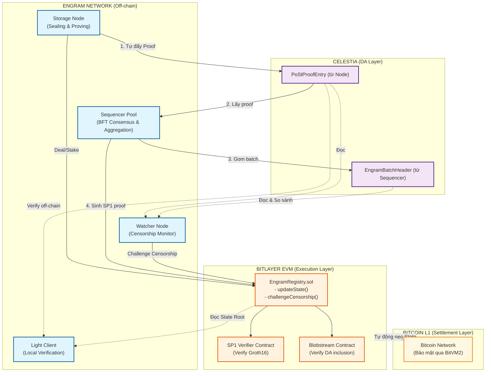
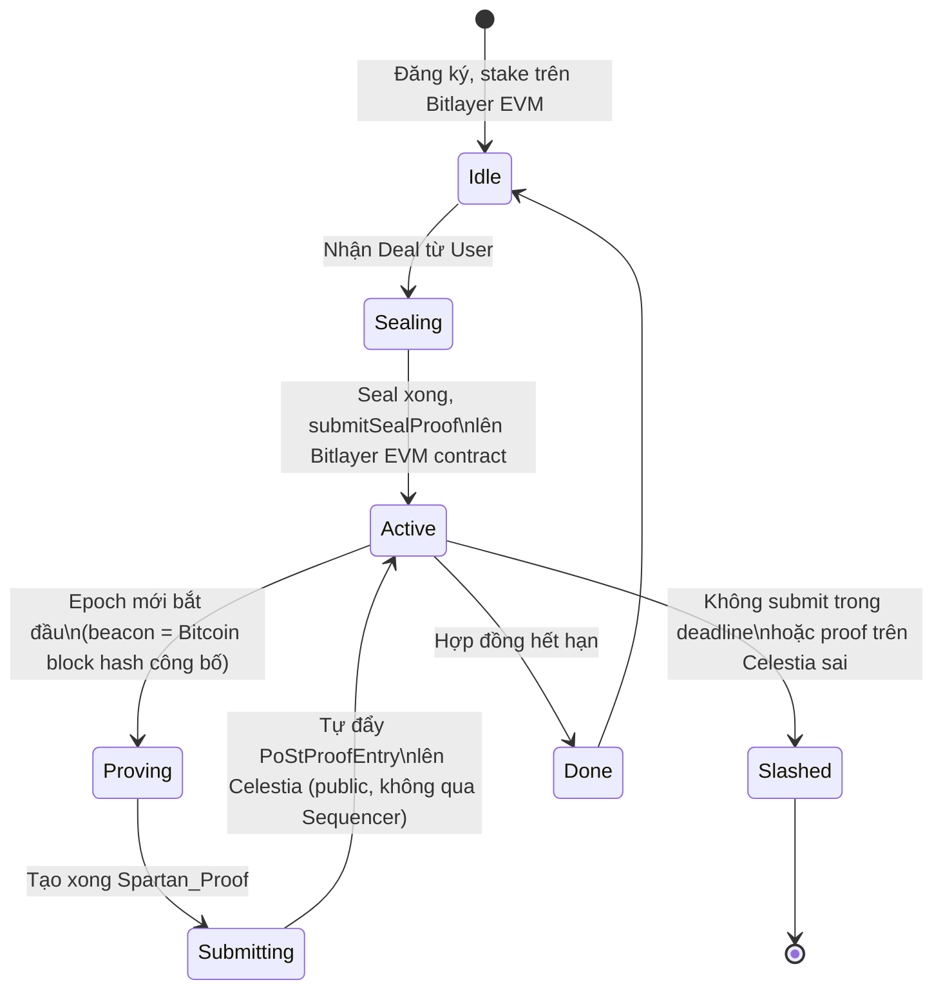
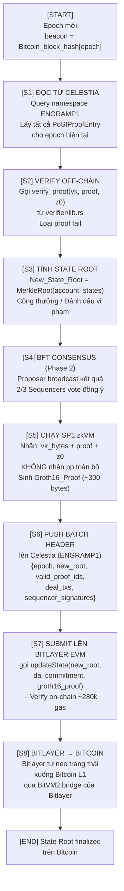
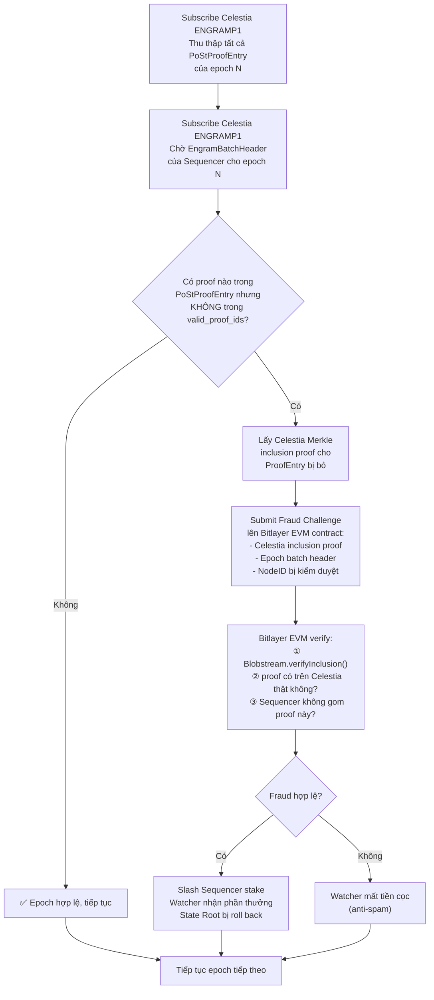
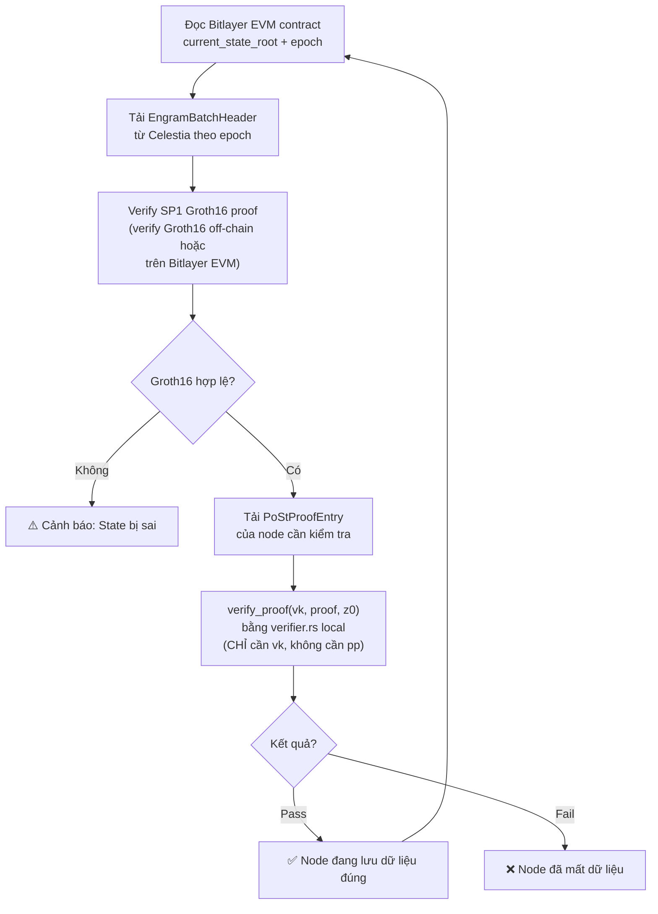
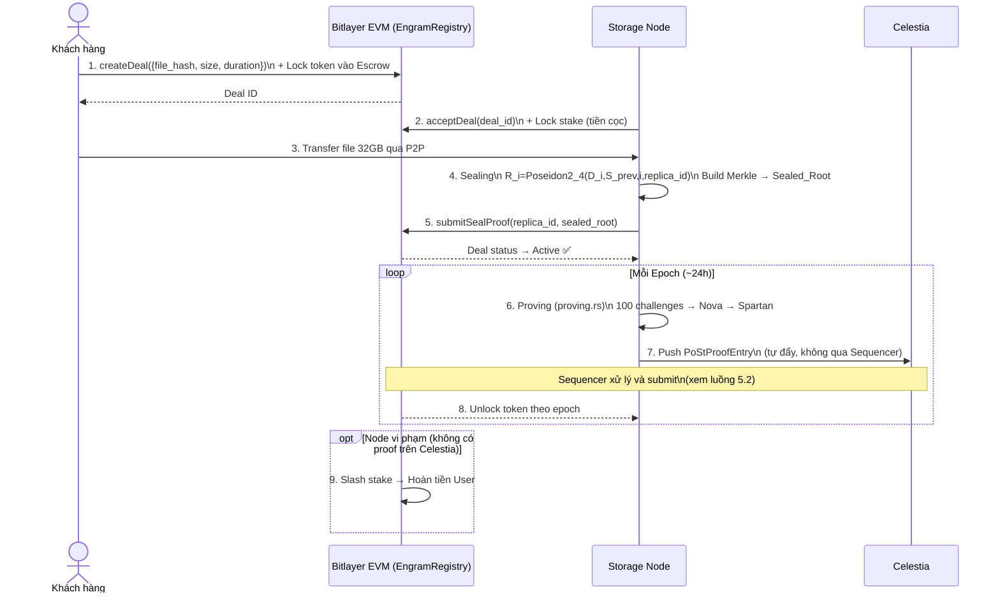
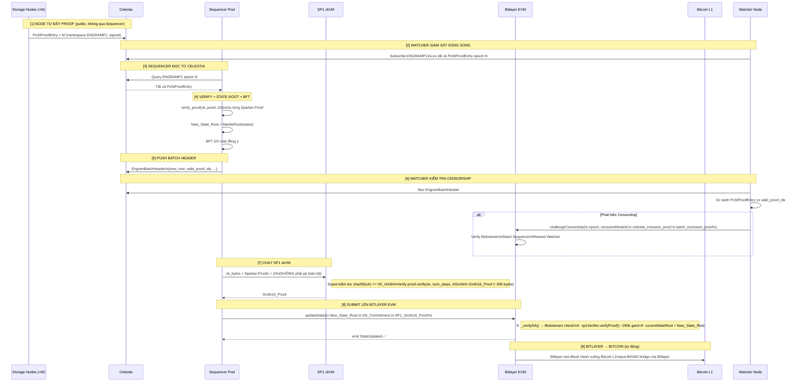

# Engram PoSt — Tài liệu Kiến trúc Hệ thống (v3)

> **Cơ sở kỹ thuật:** Toàn bộ nội dung được trích xuất từ mã nguồn:
> `sealing.rs` · `proving.rs` · `storage.rs` · `verifier/lib.rs` · `merkle_tree.rs` · `config.rs` · `main.rs`
>
> **v3:** Sửa 3 vấn đề kỹ thuật nghiêm trọng: (1) SP1 chỉ nhận `vk` thay vì `pp` toàn bộ, (2) dùng Bitlayer EVM thay vì tự implement BitVM2, (3) censorship fraud proof qua Bitlayer EVM contract.
>
> **v4:** Bổ sung 5 lỗ hổng còn thiếu: (1) Phân tích kích thước `vk` với IPA vs KZG và hệ quả bắt buộc đổi sang BN254/KZG; (2) Constraint ⑤ bịt soundness gap của Challenge Binding; (3) SMT determinism — quy định thứ tự insert; (4) Cơ chế upgrade `vk` khi nâng cấp circuit; (5) Phân tích toán học soundness và xác suất phát hiện gian lận.

---

## 0. Tổng quan và Kiến trúc

### Ngăn xếp công nghệ

### Biểu đồ Kiến trúc Toàn bộ Hệ thống



**Luận cứ chọn Bitlayer thay vì tự build BitVM2:**
- Citrea mất 18 tháng với đội ngũ chuyên sâu Bitcoin Script để implement BitVM2. Bitlayer tương tự.
- Cả hai đều có EVM layer trên BitVM2 — không phải tình cờ, mà vì EVM là môi trường duy nhất có thể verify Celestia inclusion proofs (Blobstream) khi có tranh chấp Censorship.
- Bitlayer đã có BitVM2 bridge hoạt động: Engram tận dụng thay vì tự build.

```
Kiến trúc thực tế:
Node → Celestia → Sequencer → SP1 → [Bitlayer EVM contract] → BitVM2 của Bitlayer → Bitcoin
                                              ↑
                              Tận dụng infrastructure sẵn có
```

### Tham số hệ thống (từ `config.rs`)

| Tham số | Dev/Sim | Production |
|:--------|:--------|:-----------|
| Kích thước Sector | 16 GB | **32 GB** |
| Kích thước Chunk | 4 KB | 4 KB |
| Số Chunk/Sector | ~4.1M | **~8.4M** |
| Chiều cao Merkle Tree | 22 | **23** |
| Challenge/Epoch | 50 | **100** |
| Epochs/Window | 5 | **48** |

> **[Ghi chú Merkle Tree]** Production: 32GB / 4KB = 8,388,608 ≈ 2²³ chunks → height = 23. (Không phải 30 — 30 là số leaves nếu chia theo 32 bytes/node, không phải theo chunk 4KB.)

---

## 0.1. Phân tích Toán học Soundness

### Định lý Soundness của Nova IVC

**Định lý:** Nếu `z_acc_final` verify sau `C` bước Nova folding, thì với xác suất overwhelmingly high (soundness error negligible $\varepsilon$), tất cả `C` challenges đều được tính đúng với dữ liệu thực.

**Chứng minh phác thảo:** Nova folding scheme có knowledge soundness với error $\varepsilon = O(1/|\mathbb{F}|)$ với $|\mathbb{F}|$ là kích thước trường ($|\mathbb{F}_{Pallas}| \approx 2^{255}$, $|\mathbb{F}_{BN254}| \approx 2^{254}$). Sau $C$ bước IVC, tổng soundness error là $C \cdot \varepsilon \approx 100/2^{254}$ — negligible. Spartan compression preserves soundness. $\square$

### Xác suất phát hiện gian lận

Với $N = 2^{23}$ chunks và $C$ challenges ngẫu nhiên, xác suất Prover gian lận mất fraction $f$ dữ liệu vượt qua được toàn bộ challenge:

$$P(\text{không bị phát hiện}) = \prod_{k=1}^{C}(1-f) = (1-f)^{C}$$

| Fraction mất ($f$) | $C=50$ (dev) | $C=100$ (production) | $C=459$ |
|--------------------|-------------|----------------------|---------|
| 1% | 60.5% — không đủ | 36.6% — **không đủ** | ~1% |
| 5% | 7.7% | 0.59% | $\approx 0$ |
| 10% | 0.52% | 0.0027% | $\approx 0$ |
| 20% | $\approx 1.3\times10^{-5}$ | $2\times10^{-10}$ | $\approx 0$ |

**Kết luận và hệ quả thiết kế:**

- $C=100$ đủ tốt để đảm bảo soundness khi $f > 5\%$
- Để phát hiện node mất 1% dữ liệu với xác suất 99%, cần $C \geq \lceil\log(0.01)/\log(0.99)\rceil = 459$ challenges
- **Trade-off:** $C=100$ là điểm cân bằng giữa proving cost và detection threshold cho $f \geq 5\%$
- Nếu muốn bảo vệ ở ngưỡng $f=1\%$, cần tăng $C$ lên ~460 hoặc chạy nhiều epoch liên tiếp (sliding window detection)

---

## 1. Các Thành phần trong Hệ thống

---

### 1.1. Storage Node (Thợ đào lưu trữ)

#### Nhiệm vụ
Lưu trữ vật lý dữ liệu, niêm phong (Sealing), và mỗi Epoch **tự đẩy Spartan Proof lên Celestia** — không qua Sequencer, đảm bảo proof public trước khi Sequencer xử lý.

#### Dữ liệu lưu trữ (từ `storage.rs`)

| Dữ liệu | RAM/Disk | Kích thước (32GB Sector) | Ghi chú |
|:--------|:---------|:------------------------|:--------|
| File thô của User (`D_i`) | Disk | ~32 GB | Đọc on-demand qua `get_raw_chunk()` |
| Sealed Replica (`R_i`) | RAM | ~256 MB | `replicas: Vec<Option<Fr>>` |
| State chain (`S_i`) | RAM | ~256 MB | `states: Vec<Option<Fr>>` |
| Merkle Tree | RAM | ~512 MB | `merkle_tree: Option<MerkleTree>` |
| **Tổng RAM** | RAM | **~1.0 GB** | File-backed streaming design |

#### Luồng chạy nội tại



#### Thuật toán chi tiết

**Giai đoạn A — Sealing** (code trong `sealing.rs`):

```
Input:  replica_id = Poseidon2_chain([client_id, deal_id, sector_id, copy_index, nonce])
        File thô 32GB (đọc streaming từng 4KB)

Với mỗi Chunk i = 1..N (N ≈ 8.4M):
  D_i    = bytes_to_fr(chunk_bytes)                        // 4KB → trường Pallas Fr
  R_i    = Poseidon2_4(D_i, S_{i-1}, i, replica_id)       // Replica gắn liền Node
  S_i    = Poseidon2_2(S_{i-1}, R_i)                      // State chain TUẦN TỰ
  S_0    = replica_id
  Leaf_i = Poseidon2_2(R_i, S_i)

CommD       = MerkleRoot(D_1..D_N)                         // Dùng cho Client tự verify
Sealed_Root = MerkleRoot(Leaf_1..N)                        // (hay còn gọi là CommR)
```

> **[Bảo mật Sealing — SP1 Sealing Proof]** Node phải tạo ra một Bằng chứng SP1 chứng minh: *"Tôi đã nhận đầu vào là `CommD` (Hash dữ liệu thô) và tính toán đúng quy trình tuần tự ra `Sealed_Root`"*. 
> Bằng chứng này (`sp1_sealing_proof`) cùng với `CommD` và `Sealed_Root` được nộp lên Bitlayer EVM contract thông qua hàm `submitSealProof()` ngay lúc ký hợp đồng (Deal). Nếu làm sai, Smart Contract từ chối hợp đồng ngay từ đầu.

**Giai đoạn B — Proving** (code trong `proving.rs`):

```
Input:  beacon = Bitcoin_block_hash[epoch]    // Nguồn ngẫu nhiên CÔNG KHAI

Với mỗi challenge c = 1..100:
  j_i_seed = Poseidon2_chain([beacon, sector_id, epoch, c])
  j_i_u64  = u64::from_le_bytes(j_i_seed[0..8])   // 8 bytes → 2⁶⁴ giá trị → phân bố đều trên 8.4M chunks
  j_i      = j_i_u64 % N + 1

  Public inputs z[0..6]:
    z[0]=epoch,  z[1]=step_counter,  z[2]=sector_id
    z[3]=sealed_root,  z[4]=beacon,  z[5]=replica_id
    z[6]=z_acc = Poseidon2_2(z_acc_prev, Poseidon2_2(j_i, S_ji))

  Private witness: D_ji, S_{j_i-1}, S_{j_i}, MerklePath(j_i)

  Circuit constraints:
    ① R_ji = Poseidon2_4(D_ji, S_{j_i-1}, j_i, replica_id)
    ② S_ji = Poseidon2_2(S_{j_i-1}, R_ji)
    ③ j_i_seed == Poseidon2_chain([beacon, sector_id, epoch, c])
    ④ MerkleVerify(sealed_root, R_ji, S_ji, path) == true
    ⑤ j_i == (j_i_seed & 0x7FFFFF)   // [v4] bịt soundness gap: enforce j_i được
                                       // derive trực tiếp từ j_i_seed trong circuit
                                       // Dùng bitmask thay vì modulo vì N=2^23
                                       // → chỉ cần 23 bitdecomposition constraints
                                       // Không dùng j_i = j_i_u64 % N (đắt trong R1CS)

> **[v4 — Soundness Gap đã vá]** Trước v4: circuit enforce ③ (`j_i_seed` hợp lệ) nhưng không enforce mối liên hệ giữa `j_i_seed` và `j_i`. Prover gian lận có thể cung cấp `j_i_seed` đúng để qua ③, nhưng tính `j_i` theo cách khác để trỏ vào chunk mình còn dữ liệu. Constraint ⑤ đóng lỗ hổng này: `j_i` phải bằng đúng 23 bit thấp của `j_i_seed`, enforce bằng bitdecomposition trong R1CS với chi phí chỉ 23 constraints thêm.

Nova Folding:  100 steps → RecursiveSNARK
Spartan:       RecursiveSNARK → CompressedSNARK (~vài chục KB)
```

**Giai đoạn C — Submit lên Celestia** (tự đẩy, không qua Sequencer):

```
Node push lên Celestia namespace ENGRAMP1:
PoStProofEntry {
    node_id:       [u8; 32],
    sector_id:     u64,
    sealed_root:   [u8; 32],        // z[3]
    epoch:         u64,
    num_steps:     u32,             // = 100
    z0_primary:    [[u8; 32]; 7],   // 7 public inputs
    spartan_proof: Vec<u8>,         // CompressedSNARK bytes
    node_signature: Vec<u8>,        // Chữ ký Node — Sequencer không thể giả mạo
}
→ Proof đã PUBLIC trên Celestia, không ai xóa được
```

#### Bảo mật của Storage Node

| Kịch bản (từ `AttackMode`) | Hậu quả | Tại sao bị phát hiện |
|:--------------------------|:--------|:--------------------|
| **Gian lận khi Sealing** | Bị từ chối ký Deal | SP1 Sealing Proof không hợp lệ, Smart Contract revert `submitSealProof()` |
| **KB1**: Xóa ngẫu nhiên raw chunks | Proof fail | `D_ji` không đọc được → constraint ① fail |
| **KB2**: Xóa chunk đúng vị trí challenge | Proof fail | Không có `D_ji` valid |
| **KB3**: Xóa `S_{j_i-1}` | Proof fail | Constraint ② thiếu witness |
| **KB4**: Dùng proof epoch cũ | Proof fail | `beacon` (z[4]) không khớp epoch mới → ③ fail |
| **Fake sealed_root** | Proof fail | Public input cố định, không thể thay đổi sau commit |

#### Tính khả thi

| Yếu tố | Đánh giá | Chi tiết |
|:-------|:---------|:---------|
| Sealing time (32GB) | 🟡 Chấp nhận | ~27 phút single-thread, làm 1 lần duy nhất |
| RAM Sealing | ✅ Tối ưu | ~1GB (file-backed design) |
| Proving (100 challenges) | ✅ Nhanh | Vài giây đến vài chục giây (đã benchmark) |
| Proof size | ✅ Nhỏ | ~vài chục KB |

---

### 1.2. Sequencer Pool (Nhóm điều phối)

#### Nhiệm vụ
Đọc Spartan Proof từ Celestia, xác minh off-chain bằng `verifier.rs`, tổng hợp State Root, chạy SP1 zkVM để tạo Groth16 Proof, và submit lên Bitlayer EVM contract.

#### Mô hình Sequencer — 3 giai đoạn tiến hóa

| Giai đoạn | Mô hình | Đồng thuận | Tradeoff |
|:---------|:--------|:----------|:---------|
| **MVP** | 1 Sequencer tập trung | Không cần | Đơn giản; Single PoF |
| **Phase 2** | N=10 Sequencers, stake-based | BFT 2/3 majority (Tendermint) | An toàn hơn; phức tạp hơn |
| **Phase 3** | Permissionless | Smart contract phân xử | Phi tập trung tuyệt đối |

#### Luồng chạy nội tại mỗi Epoch



#### Vấn đề SP1 và Giải pháp — `pp` vs `vk` (phân tích từ code thực tế)

Từ `verifier/lib.rs` và `proving.rs`, cấu trúc thực tế là:

```rust
// proving.rs — 3 đối tượng KHÁC NHAU:
pub struct ProvingPipeline {
    pub pp: PublicParams<G1, G2, EngramStepCircuit>,  // RẤT LỚN — dùng để setup
    pub pk: ProverKey<...>,                            // Dùng để prove
    pub vk: EngramVerifierKey,                         // DÙNG ĐỂ VERIFY — nhỏ hơn nhiều
}

// verifier/lib.rs — verify CHỈ CẦN vk, KHÔNG CẦN pp:
pub fn verify_proof(
    pp: &PublicParams<...>,     // ← Chỉ cần nếu không có vk_opt
    proof: &CompressedSNARK<...>,
    num_steps: usize,
    z0_primary: Vec<NovaFr>,
    vk_opt: Option<&EngramVerifierKey>,  // ← Nếu có vk → dùng trực tiếp, bỏ qua pp
) -> (bool, VerificationMetrics) {
    let vk = match vk_opt {
        Some(v) => v,                       // Dùng vk được truyền vào
        None => CompressedSNARK::setup(pp)  // Chỉ gọi nếu KHÔNG có vk
    };
    proof.verify(vk, num_steps, &z0_primary)  // ← Verify thực sự chỉ cần vk
}
```

> **[Phân tích]** `pp` cần cho `setup()` để sinh ra `pk` + `vk`. Nhưng `verify()` chỉ cần `vk`. SP1 guest không cần `pp` — chỉ cần `vk` serialized.

**SP1 Guest Program — thiết kế đúng (Bổ sung State Transition & Check Sealed Root):**

```rust
// sp1_engram_verifier/src/main.rs (SP1 guest)
fn main() {
    // ① Đọc vk_hash đã hardcode (const trong binary) — không thay đổi được
    const VK_HASH: [u8; 32] = include_bytes!("../vk_hash.bin");

    // ② Đọc inputs từ SP1 host
    let vk_bytes: Vec<u8>      = sp1_zkvm::io::read();   // EngramVerifierKey serialized
    let spartan_proof: Vec<u8> = sp1_zkvm::io::read();   // CompressedSNARK bytes
    let z0_primary: Vec<[u8;32]> = sp1_zkvm::io::read(); // 7 public inputs
    let num_steps: u32         = sp1_zkvm::io::read();
    
    // [BỔ SUNG] Đọc State (Merkle Root của các Deal hiện tại)
    let prev_state_root: [u8; 32] = sp1_zkvm::io::read();
    let account_merkle_proof: Vec<[u8; 32]> = sp1_zkvm::io::read();

    // ③ Kiểm tra vk đúng với hệ thống (chống vk giả mạo)
    assert_eq!(sha256(&vk_bytes), VK_HASH, "vk không khớp với hệ thống");

    // ④ Deserialize
    let vk: EngramVerifierKey   = bincode::deserialize(&vk_bytes).unwrap();
    let proof: CompressedSNARK  = bincode::deserialize(&spartan_proof).unwrap();
    let z0: Vec<NovaFr>         = deserialize_z0(&z0_primary);

    // [BỔ SUNG] Kiểm tra chéo Sealed_Root (z[3]) với State Tree
    let sealed_root_from_proof = z0[3]; 
    let node_id = z0[5]; // replica_id
    
    // Verify Merkle Proof: Chứng minh node_id này CÓ ĐĂNG KÝ sealed_root này trong prev_state_root
    let is_valid_deal = verify_merkle_inclusion(
        prev_state_root, 
        node_id, 
        sealed_root_from_proof, 
        &account_merkle_proof
    );
    assert!(is_valid_deal, "Sealed Root khong khop voi Deal da dang ky tren he thong!");

    // ⑤ Verify (CHỈ CẦN vk — không cần pp)
    let is_valid = proof.verify(&vk, num_steps as usize, &z0).is_ok();

    // ⑥ Commit kết quả ra ngoài để Bitlayer EVM contract kiểm tra
    sp1_zkvm::io::commit(&is_valid);
    sp1_zkvm::io::commit(&VK_HASH);
}
```

**Kích thước ước tính:**

| Đối tượng | Kích thước | Đưa vào SP1? |
|:----------|:----------|:------------|
| `PublicParams (pp)` | ~hàng trăm MB | ❌ KHÔNG — blocker |
| `ProverKey (pk)` | ~hàng trăm MB | ❌ KHÔNG |
| **`VerifierKey (vk)`** | **Chưa đo — ước tính vài MB đến vài trăm MB** | 🟡 **Phụ thuộc kết quả đo** |
| `CompressedSNARK (proof)` | ~vài chục KB | ✅ CÓ |
| `z0_primary` (7 × 32 bytes) | 224 bytes | ✅ CÓ |

> **[Ghi chú]** Kích thước chính xác của `EngramVerifierKey` cần đo thực tế bằng `bincode::serialize(&vk).unwrap().len()`. Nếu `vk` vẫn còn lớn (>100MB), có thể cần dùng một chứng minh Merkle rằng `vk` là tập con của cấu trúc lớn — nhưng đây là edge case cần kiểm tra sau.

#### Mở rộng cho M Storage Nodes (SP1 Scaling)

Trong mỗi Epoch, có M Storage Nodes gửi M Spartan proofs. Có 2 cách tiếp cận xử lý:

1. **Verify tuần tự trong 1 SP1 run (O(M) cost):** Một SP1 guest nhận một mảng `Vec<CompressedSNARK>` và chạy vòng lặp `verify()` M lần. Cuối cùng trả ra 1 Groth16 proof duy nhất.
   - *Ưu điểm:* Tiết kiệm gas on-chain vì chỉ verify 1 Groth16 proof cho cả Epoch.
   - *Nhược điểm:* Proving time của SP1 bị đẩy lên rất cao khi M lớn, có thể vượt qua giới hạn cycle của zkVM.

2. **Verify song song (M SP1 runs):** Sequencer chạy M instances của SP1 song song, sinh ra M Groth16 proofs. Bitlayer EVM contract phải có hàm nhận vào mảng M proofs để verify.
   - *Ưu điểm:* Proving time không phụ thuộc vào M (có thể scale horizontal trên cloud).
   - *Nhược điểm:* EVM gas cost tăng tuyến tính $O(M)$ (M × ~280k gas).

> **Lựa chọn hiện tại:** Để đơn giản trong Phase 2, thiết kế sẽ dùng **Cách 1** (1 SP1 run gom batch) nhưng nếu benchmark cho thấy SP1 cycle bị vượt quá giới hạn, hệ thống sẽ được chuyển sang **Cách 2** kết hợp đệ quy (recursive verification) để gộp M proofs thành 1 proof cuối cùng.

#### SP1 đảm bảo gì — và KHÔNG đảm bảo gì

> **Giới hạn cơ bản của mọi zkVM:** SP1 chứng minh "Với đầu vào X, tôi đã chạy đúng chương trình và ra đầu ra Y". Nó **không tự mình lên Celestia** để kiểm tra xem X có đầy đủ hay không.

| Tính chất | Ai đảm bảo | Cơ chế |
|:----------|:----------|:-------|
| **Soundness** — không ai gian lận phép tính | SP1 zkVM | Groth16 proof không thể làm giả |
| **Input Authenticity** — input đúng là từ Celestia | `daCommitment` binding | `publicValues` nhúng DataRoot vào proof |
| **Completeness** — không ai bị bỏ sót | Watcher + Fraud Proof | SMT non-inclusion proof trên EVM |

**Cơ chế ràng buộc input SP1 vào Celestia (daCommitment binding):**

Khi Sequencer gọi `updateState()`, Smart Contract chạy **hai vòng kiểm tra chéo nhau độc lập**:

```
① _verifyDA(daCommitment)
   → Blobstream.verifyAttestation(nonce, DataRootTuple, MerkleProof)
   → Xác minh: DataRoot này đúng là từ Celestia, có chữ ký >2/3 Validator
   → Không thể bịa DataRoot hợp lệ mà không có đồng thuận Celestia

② sp1Verifier.verifyProof(programVKey, publicValues, sp1Proof)
   publicValues = abi.encode(currentStateRoot, newStateRoot, daCommitment, epoch)
   → daCommitment được nhúng VÀO publicValues
   → Groth16 proof commit vào đúng DataRoot đó
   → Không thể dùng DataRoot thật nhưng chạy SP1 với dữ liệu giả
```

**Tại sao không thể gian lận:**
- Bịa `daCommitment` → vòng ① revert ngay
- Dùng `daCommitment` thật nhưng chạy SP1 với dữ liệu khác → `publicValues` không khớp → vòng ② fail
- Dùng `daCommitment` của epoch khác → epoch binding trong `publicValues` không khớp → fail

**Điều SP1 vẫn KHÔNG ngăn được:** Sequencer lấy đúng DataRoot từ Celestia nhưng **chỉ tải một phần** proof về để chạy SP1, cố tình bỏ sót Node A. `daCommitment` vẫn hợp lệ (DataRoot thật), `sp1Proof` vẫn hợp lệ (tính đúng trên dữ liệu đã chọn lọc). Đây là bài toán **Censorship** — phải dùng Watcher + Fraud Proof để giải quyết.

#### Cơ chế đảm bảo tính trung thực — 3 lớp

**Lớp 1 — SP1 ZK Proof (Bảo vệ Toán học):**
> SP1 chứng minh rằng `verifier.rs` với `vk_hash` đã biết đã chạy đúng và kết quả là `New_State_Root`. Không thể làm giả Groth16 Proof hợp lệ cho State Root sai.

**Lớp 2 — Celestia DA (Minh bạch Dữ liệu):**
> Proof của Storage Node đã public trên Celestia trước khi Sequencer xử lý. Watcher so sánh `PoStProofEntry` (Node đẩy) vs `valid_proof_ids` (Sequencer gom) → phát hiện Censorship. Bằng chứng Censorship là Celestia Merkle inclusion proof.

**Lớp 3 — Bitlayer EVM Fraud Resolution (Phân xử Tranh chấp):**
> Bitlayer EVM contract có thể verify Celestia Blobstream inclusion proof. Khi Watcher phát hiện Censorship, contract trên Bitlayer kiểm tra bằng chứng → slash Sequencer nếu đúng → trạng thái được cập nhật → neo xuống Bitcoin qua BitVM2 của Bitlayer.

**Bảng tổng hợp:**

| Kiểu gian lận | Phát hiện bởi | Cơ chế ngăn chặn | Hậu quả |
|:-------------|:-------------|:----------------|:--------|
| Fake State Root | Bitlayer EVM contract | SP1 Groth16 verify fail → revert | Mất phí gas |
| Không push Blob | Bitlayer EVM contract | Blobstream DA check fail → revert | Mất phí gas |
| **Censorship (bỏ proof)** | Watcher | **Bitlayer EVM verify Celestia inclusion proof** → slash | Slash stake |
| Thay đổi beacon | Bitlayer EVM contract | z[4] binding → SP1 proof fail | Mất phí gas |
| Không hoạt động | BFT + Liveness | Rotate Proposer, slash stake | Slash stake |

#### Tại sao phân xử Censorship cần Bitlayer EVM, không thể dùng Bitcoin Script trực tiếp

```
Watcher muốn chứng minh: "Proof X tồn tại trên Celestia nhưng Sequencer không gom"

Bằng chứng cần verify:
  ① Celestia Merkle inclusion proof (chứng minh proof X có trong Celestia block)
  ② Celestia block header phải khớp với data root đã commit

Bitcoin Script:
  ❌ Không thể đọc Celestia data
  ❌ Không có hàm hash Celestia-compatible
  ❌ Không có state để lưu DA commitments

Bitlayer EVM contract:
  ✅ Có Blobstream contract (verify Celestia inclusion proof)
  ✅ Có state (lưu DA commitments theo epoch)
  ✅ Có full EVM — verify bất kỳ logic phức tạp nào
  ✅ Kết quả phán xử được neo xuống Bitcoin qua BitVM2 của Bitlayer
```

#### Tính khả thi

| Yếu tố | Đánh giá | Chi tiết |
|:-------|:---------|:---------|
| **SP1 với `vk` (không `pp`)** | 🟡 Khả năng cao | `vk` + proof + z0. Blocker pp đã loại bỏ. Nhưng **chưa benchmark** proving time với Pallas/Vesta non-native field |
| **Kích thước `vk`** | 🔴 Chưa đo — ưu tiên #1 | Chạy `bincode::serialize(&vk).len()` trong `vk_size` binary. Nếu `vk` > 100MB → cần giải pháp khác |
| **SP1 proving time (Pallas)** | 🔴 Chưa đo — ưu tiên #2 | Pallas không có precompile trong SP1. Overhead non-native có thể 500x–100,000x |
| **Bitlayer EVM** | ✅ Có sẵn | Bitlayer mainnet active, EVM-compatible |
| **Blobstream trên Bitlayer** | 🟡 Cần xác nhận | Kiểm tra docs Bitlayer trước khi bắt đầu Phase 2 |
| **BFT Consensus** | 🟡 Phase 2 | Tendermint/CometBFT có thư viện trưởng thành |

#### Phương án tích hợp SP1 — 2 Options

> **[Constraint quan trọng]** Nova folding scheme và Spartan compression **buộc phải dùng cùng curve cycle**. Spartan nén output của Nova (một relaxed R1CS instance định nghĩa trên trường vô hướng của G1). Không thể tách rời: đổi Spartan sang BN254 trong khi Nova vẫn dùng Pallas sẽ đòi hỏi non-native arithmetic ngay tại bước đầu tiên.

```
Nova (Pallas + Vesta) → RecursiveSNARK [defined over Pallas.Fr]
                                ↓
Spartan compress → reads R1CS over Pallas.Fr → phải dùng Pallas
                                ↓ (không thể đổi một mình Spartan)
SP1 → emulate Pallas trên BabyBear → overhead cực lớn
```

---

##### Option A — Giữ nguyên Pallas/Vesta (hiện tại)

**Đặc điểm:**
- Không thay đổi gì trong codebase
- Spartan nén Nova đúng native trên Pallas → proof nhỏ, verify nhanh off-chain
- **Vấn đề:** SP1 không có precompile cho Pallas — toàn bộ field arithmetic phải emulate trên BabyBear

**Chi phí ước tính trong SP1:**
```
ECDSA P-256 verify (có precompile): ~11.8M cycles
Spartan verify Pallas (không precompile, non-native emulation):
    → ước tính 500M – 10B cycles
    → proving time: vài chục phút đến vài giờ / 1 proof
    → không khả thi cho production
```

**Khi nào nên dùng Option A:**
- Chỉ verify Spartan off-chain (Light Client, Watcher) — không cần SP1
- Phase 1 (hiện tại): mục tiêu chỉ là test pipeline, không cần on-chain proof

---

##### Option B — Đổi sang BN254 + Grumpkin *(khuyến nghị cho SP1 integration)*

**Ý tưởng:** Đổi toàn bộ curve cycle của Nova+Spartan sang BN254+Grumpkin. SP1 có **native precompile cho BN254**, loại bỏ overhead non-native hoàn toàn.

**[v4 — Lý do quan trọng hơn SP1 precompile: Kích thước `vk` với IPA vs KZG]**

Đây là lý do **bắt buộc** phải đổi sang BN254/KZG, không chỉ vì SP1 precompile:

| Commitment Scheme | Kích thước `vk` | Công thức | Với $n=10^6$ constraints |
|-------------------|----------------|-----------|--------------------------|
| **IPA** (Pallas/Vesta hiện tại) | $O(n)$ | $n$ group elements × 64 bytes | **~64 MB** |
| **KZG** (BN254/Grumpkin) | $O(1)$ | 2 group elements ($[τ]_1, [τ^d]_2$) + metadata | **~200 bytes** |

IPA commitment key có kích thước $O(n)$ vì mỗi vị trí trong polynomial cần một generator riêng. KZG chỉ cần 2 điểm từ trusted setup ($[τ]_1$ và $[τ^d]_2$) bất kể $n$ lớn đến đâu.

**Hệ quả trực tiếp:**
- Với IPA: `vk` ~64MB → đưa vào SP1 guest là bottleneck nghiêm trọng (64MB witness)
- Với KZG: `vk` ~200 bytes → đưa vào SP1 guest hoàn toàn trivial

**Tại sao BN254+Grumpkin là valid cycle pair:**
```
BN254.Fr   = Grumpkin.Fq  ✅ (trường vô hướng BN254 = trường cơ sở Grumpkin)
Grumpkin.Fr = BN254.Fq   ✅ (trường vô hướng Grumpkin = trường cơ sở BN254)

→ Nova vẫn fold đúng, Spartan compress đúng
→ nhưng giờ toàn bộ trên BN254 → SP1 precompile native
```

**Thay đổi code cần làm:**

```rust
// proving.rs — CHỈ đổi 2 dòng type alias:
// TRƯỚC (Option A):
pub type G1 = PallasEngine;
pub type G2 = VestaEngine;

// SAU (Option B):
pub type G1 = nova_snark::provider::Bn254EngineKZG;  // BN254
pub type G2 = nova_snark::provider::GrumpkinEngine;  // Grumpkin
```

> **[Ghi chú thư viện]** `nova-snark` (phiên bản hiện dùng trong `Cargo.toml`) hỗ trợ `Bn254EngineKZG` và `GrumpkinEngine` — xác nhận bằng `cargo doc --open`. Không cần thêm dependency ngoài.

**Hệ quả của việc đổi:**

| Thành phần | Thay đổi | Ghi chú |
|:-----------|:---------|:--------|
| `EngramStepCircuit` | ✅ Không đổi | Circuit logic giữ nguyên |
| `poseidon2_gadget.rs` | 🟡 Có thể cần kiểm tra | Poseidon2 params phụ thuộc field — xác nhận với BN254.Fr |
| `PublicParams (pp)` | ✅ Regenerate tự động | Gọi lại `ProvingPipeline::setup()` |
| `EngramVerifierKey (vk)` | ✅ Regenerate tự động | Kích thước có thể thay đổi |
| `CompressedSNARK` format | ✅ Tương thích | Cùng kiểu, khác curve |
| `verifier/lib.rs` | ✅ Không đổi | Type aliases tự propagate |

**Chi phí ước tính trong SP1 sau khi đổi:**
```
BN254 scalar multiply (precompile native): ~vài triệu cycles
Spartan verify BN254 (với precompile): ước tính 10M – 100M cycles
    → proving time: vài giây đến vài phút / 1 proof trên GPU
    → có thể scale cho production
```

**So sánh 2 Options:**

| | Option A (Pallas/Vesta) | Option B (BN254/Grumpkin) |
|:|:----------------------|:------------------------|
| Code thay đổi | Không | 2 dòng type alias |
| **`vk` size [v4]** | 🔴 **~64MB (IPA, O(n))** | 🟢 **~200 bytes (KZG, O(1))** |
| SP1 proving time | 🔴 Vài giờ (ước tính lý thuyết\*) | 🟢 Vài giây–phút (ước tính lý thuyết\*) |
| Off-chain verify speed | ✅ Nhanh | ✅ Nhanh tương đương |
| Poseidon2 gadget | ✅ Đã test | 🟡 Cần kiểm tra lại |
| Trusted setup | Không cần (IPA) | 🟡 KZG — dùng Ethereum Powers of Tau (đã public) |
| Thời điểm áp dụng | Hiện tại (Phase 1) | **Bắt buộc trước Phase 2** |

> **[v4 — Kết luận cứng]** Với IPA, `vk` ~64MB — không thể đưa vào SP1 guest. Đây không phải trade-off mà là **blocker cứng**. Option B là bắt buộc cho Phase 2, không phải tùy chọn.

> **[Khuyến nghị]** Giữ Option A trong Phase 1 (testing pipeline). Chuyển sang Option B **trước khi** bắt đầu build SP1 guest program ở Phase 2, vì đổi curve sau khi đã build SP1 guest sẽ phải rebuild lại toàn bộ.

*(*) Chưa có benchmark thực tế. Cần đo bằng `sp1-perf` trước khi commit sang Option B.*

> **[Lưu ý KZG]** `Bn254EngineKZG` dùng KZG polynomial commitment thay vì IPA. KZG cần trusted setup (SRS — Structured Reference String). Có thể dùng SRS có sẵn từ Ethereum KZG ceremony (Powers of Tau) — đã public và được hàng chục nghìn người đóng góp (Ethereum KZG ceremony 2023).

---

### 1.3. Watcher Node (Node giám sát)

#### Nhiệm vụ
Giám sát liên tục. Phát hiện Censorship và gian lận. Submit Fraud Proof lên Bitlayer EVM contract khi cần. Đây là thành phần đảm bảo tính phi tập trung thực sự — không ai cần tin tưởng Sequencer vì Watcher luôn có thể thách thức.

#### Luồng phát hiện Censorship



#### Cấu trúc Fraud Proof khi phát hiện Censorship

Fraud Proof gồm **đúng 2 thành phần**, thiếu một trong hai thì Smart Contract reject ngay:

**Thành phần 1 — Celestia Inclusion Proof** *(chứng minh Node A CÓ nộp bài)*
```
{
  epoch:        1,
  node_id:      hash(Node_A),
  blob_data:    PoStProofEntry đầy đủ của Node A,
  merkle_path:  [sibling_hash_1, sibling_hash_2, ...]
  // Đường dẫn Merkle từ PoStProofEntry của A lên DataRoot X trên Celestia
  // Smart Contract dùng Blobstream để verify path này — thuần toán học
}
```

**Thành phần 2 — SMT Non-Inclusion Proof** *(chứng minh Node A KHÔNG có trong danh sách Sequencer)*
```
{
  epoch:        1,
  node_id:      hash(Node_A),
  smt_proof:    Chứng minh hash(Node_A) VẮNG MẶT
                trong Sparse Merkle Tree có root = epochProofMerkleRoot[epoch]
  // epochProofMerkleRoot[epoch] đã được Sequencer commit lên chain lúc updateState()
  // Smart Contract tự verify — thuần toán học, không cần tin Watcher
}
```

> **Tại sao phải dùng Sparse Merkle Tree (SMT) thay vì Merkle Tree thông thường?**
> Merkle Tree thông thường chỉ chứng minh được **sự hiện diện** (inclusion). Để chứng minh **sự vắng mặt** (non-inclusion) cần cấu trúc có địa chỉ xác định — SMT lưu mọi lá theo key hash, nếu một key không tồn tại thì đường dẫn về lá trống là bằng chứng vắng mặt không thể làm giả.

#### Bitlayer EVM phân xử hoàn toàn bằng toán học — không tin ai

```solidity
function challengeCensorship(epoch, censoredNodeId,
    celestiaInclusionProof, smtNonInclusionProof) {

    // KIỂM TRA 1: Node A có nộp bài lên Celestia không?
    // Gọi Blobstream.verifyAttestation() → verify Merkle path
    // từ PoStProofEntry của A đến DataRoot đã neo qua ZK Proof.
    // Không tin Watcher — chỉ tin Merkle Hash.
    require(_verifyNodeProofOnDA(epoch, censoredNodeId, celestiaInclusionProof));

    // KIỂM TRA 2: Node A có bị Sequencer bỏ sót không?
    // Contract đã lưu epochProofMerkleRoot[epoch] từ lúc Sequencer
    // gọi updateState(). Verify SMT non-inclusion path vào root đó.
    // Không tin Watcher — chỉ tin Sparse Merkle Hash.
    require(_verifySMTNonInclusion(
        epochProofMerkleRoot[epoch], censoredNodeId, smtNonInclusionProof
    ));

    // Cả 2 check pass → Sequencer đã cố tình kiểm duyệt.
    // Kết quả là TẤT YẾU của 2 phép toán độc lập, không cần trust bất kỳ ai.
    _slash(currentSequencer, epoch);
}
```

| Bước | Smart Contract làm gì | Nền tảng tin cậy |
|:-----|:---------------------|:-----------------|
| Verify Celestia inclusion | Gọi Blobstream → verify Merkle Hash | ZK Proof chữ ký >2/3 Validator Celestia |
| Verify SMT non-inclusion | Tự chạy SMT verify | Toán học thuần túy |
| Slash Sequencer | Trừ tiền cọc tự động | Solidity code deterministic |

#### Bảng giám sát đầy đủ

| Kịch bản | Cách phát hiện | Hành động của Watcher |
|:---------|:--------------|:--------------------|
| Censorship | `PoStProofEntry` có trên DA, không trong `epochProofMerkleRoot` | Submit 2-phần Fraud Proof lên Bitlayer EVM |
| Fake State Root | SP1 proof verify fail (verify Groth16 local) | Bitlayer EVM tự revert (không cần Watcher) |
| Node KB1–KB4 | `verify_proof(vk, ...)` fail trên proof trên Celestia | Báo cáo; Sequencer loại proof đó |
| Sequencer không submit | Timeout sau deadline | Rotate sang Sequencer tiếp theo |

#### Tính khả thi

| Yếu tố | Đánh giá | Chi tiết |
|:-------|:---------|:---------|
| Logic giám sát | ✅ Có skeleton | `simulator_runner/main.rs` là template |
| Chi phí vận hành | ✅ Thấp | Chỉ verify, không Sealing/Proving |
| Incentive | 🟡 Cần thiết kế | Watcher nhận phần thưởng từ slash Sequencer |
| Anti-spam | ✅ Cần | Watcher phải đặt cọc nhỏ trước khi challenge |

---

### 1.4. Light Client (Node xác minh nhẹ)

#### Nhiệm vụ
Cho phép User/Developer theo dõi trạng thái và verify dữ liệu của mình mà không cần tin tưởng Sequencer hay Bitlayer.

#### Dữ liệu lưu trữ

| Dữ liệu | Kích thước | Mục đích |
|:--------|:----------|:---------|
| `current_state_root` (32 bytes) | Negligible | Trạng thái hiện tại |
| `EngramVerifierKey (vk)` cache | ~vài MB–vài chục MB | Verify Spartan Proof (tải 1 lần, cache local) |
| `PoStProofEntry` (tải tạm) | ~vài chục KB/proof | Tải từ Celestia để verify |
| Bitcoin UTXO index | Vài KB | Theo dõi State Root commitments |

#### Xác minh File Tải về (Data Verification)
Khi Client muốn tải file về từ Storage Node, cơ chế bảo vệ diễn ra như sau:
1. **Trước khi Upload:** Máy Client tự tính `CommD` (Merkle Root của toàn bộ dữ liệu thô) và lưu lại.
2. **Khi Download:** Máy Client yêu cầu Node trả file thô về. Vừa tải, máy Client vừa tự động băm lại ra một mã Hash mới.
3. **Đối chiếu:** Nếu Hash tải về khớp 100% với `CommD` đã lưu -> File an toàn. Nếu lệch -> Client từ chối nhận và mang bằng chứng lên kiện Node trừ tiền cọc.

#### Luồng chạy giám sát trạng thái



---

## 2. Lớp DA — Celestia

### Namespace và 2 loại Blob

**Namespace:** `0x454e4752414d5031` ("ENGRAMP1")

**Loại 1 — PoStProofEntry** (Storage Node tự đẩy, public trước Sequencer):
```rust
PoStProofEntry {
    node_id:        [u8; 32],       // ID Storage Node
    sector_id:      u64,
    sealed_root:    [u8; 32],       // z[3] từ IVC circuit
    epoch:          u64,
    num_steps:      u32,            // = 100
    z0_primary:     [[u8; 32]; 7],  // 7 public inputs
    spartan_proof:  Vec<u8>,        // CompressedSNARK (~vài chục KB)
    node_signature: Vec<u8>,        // Chữ ký Node — không ai giả được
}
```

**Loại 2 — EngramBatchHeader** (Sequencer đẩy sau khi gom và verify):
```rust
EngramBatchHeader {
    epoch_number:         u64,
    timestamp:            u64,
    prev_state_root:      [u8; 32],
    new_state_root:       [u8; 32],
    valid_proof_ids:      Vec<[u8; 32]>,    // node_id của proof HỢP LỆ đã gom
                                            // [v4] PHẢI được sắp xếp tăng dần theo node_id
                                            // để Watcher reproduce SMT deterministically
    epoch_proof_smt_root: [u8; 32],         // [v4] SMT root của valid_proof_ids
                                            // SMT key=node_id, value=hash(spartan_proof)
                                            // Insert theo thứ tự tăng dần của node_id
                                            // → Watcher dùng để build non-inclusion proof
    deal_transactions:    Vec<DealTx>,
    sequencer_signatures: Vec<Signature>,   // 2/3 Sequencer BFT signatures
}
```

> **[v4 — SMT Determinism]** `valid_proof_ids` phải được sort tăng dần theo `node_id` trước khi insert vào SMT. Quy tắc này đảm bảo: bất kỳ ai có danh sách `valid_proof_ids` đều reproduce được cùng `epoch_proof_smt_root`. Nếu không có thứ tự xác định, Watcher và Sequencer có thể build SMT khác nhau → `smt_root` không khớp → fraud proof không verify được.
>
> **Tại sao phải dùng SMT thay vì Merkle Tree thông thường?** Merkle Tree chỉ chứng minh được **sự hiện diện** (inclusion). Để chứng minh **sự vắng mặt** (non-inclusion) cần cấu trúc có địa chỉ xác định — SMT lưu mọi lá theo key hash, nếu một key không tồn tại thì đường dẫn về lá trống là bằng chứng vắng mặt không thể làm giả.

### Tính khả thi

| Yếu tố | Đánh giá | Chi tiết |
|:-------|:---------|:---------|
| Celestia SDK | 🟡 Chưa tích hợp | Cần implement trong Phase 2 |
| Chi phí | ✅ Rẻ | ~100x rẻ hơn Ethereum calldata |
| Blobstream trên Bitlayer | 🟡 Cần xác nhận | Kiểm tra Bitlayer docs |

---

## 3. Lớp Execution — Bitlayer EVM

### Bitlayer là gì?

Bitlayer là Bitcoin L2 dùng BitVM2 architecture. Cung cấp môi trường **EVM-compatible** được bảo mật bởi BitVM2 và Bitcoin PoW. Đây là lý do chọn Bitlayer thay vì tự build BitVM2:

| | Tự build BitVM2 | Dùng Bitlayer |
|:|:--------------|:-------------|
| Thời gian | ~18 tháng (như Citrea) | Vài tuần deploy contract |
| Rủi ro | Cao — Bitcoin Script rất phức tạp | Thấp — đã được audit |
| Censorship dispute | ❌ Bitcoin Script không verify Celestia | ✅ EVM verify Blobstream |
| Groth16 verify | ❌ Cần implement BitVM2 verifier | ✅ SP1 Groth16 verify on EVM ~280k gas |

### Cấu trúc Smart Contract trên Bitlayer

```solidity
// SPDX-License-Identifier: MIT
pragma solidity ^0.8.20;

interface IBlobstream {
    function verifyAttestation(
        uint64 tupleRootNonce,
        DataRootTuple calldata tuple,
        BinaryMerkleProof calldata proof
    ) external view returns (bool);
}

interface ISP1Verifier {
    function verifyProof(
        bytes32 programVKey,
        bytes calldata publicValues,
        bytes calldata proofBytes
    ) external view;
}

contract EngramRegistry {
    // ── Cấu hình hệ thống ──
    IBlobstream  public blobstream;
    ISP1Verifier public sp1Verifier;
    bytes32      public programVKey;

    // [v4] Cơ chế upgrade vk khi nâng cấp circuit
    // Khi Engram nâng cấp circuit (đổi curve, thêm constraint...), vk thay đổi.
    // Mọi proof cũ sẽ không verify được với vk mới → cần mapping version.
    // approvedVkHashes[vkHash] = true có nghĩa vkHash này đã được governance approve.
    // publicValues phải nhúng vkHash vào → contract check vkHash có trong approved set.
    mapping(bytes32 => bool) public approvedVkHashes;
    bytes32 public currentVkHash;  // vkHash đang active

    event VkHashAdded(bytes32 vkHash);
    event VkHashRevoked(bytes32 vkHash);

    // ── Trạng thái mạng ──
    bytes32      public currentStateRoot;
    address      public currentSequencer;    // FIX: khai báo rõ ràng
    uint64       public lastFinalizedEpoch;

    // Dispute window: State Root chưa finalized trong 24h sau updateState()
    mapping(uint64 => bytes32)  public pendingStateRoot;   // epoch => root
    mapping(uint64 => uint256)  public pendingDeadline;    // epoch => timestamp

    // [BỔ SUNG] Cấu trúc Deal lưu trữ CommD và CommR
    struct Deal {
        address client;
        address storageNode;
        bytes32 commD;       // Data Root (Dữ liệu gốc chưa mã hóa)
        bytes32 sealedRoot;  // CommR (Dữ liệu đã mã hóa bởi Poseidon)
        uint64  startTime;
        uint64  endTime;
        bool    isActive;
    }

    mapping(bytes32 => Deal)    public deals;
    mapping(address => uint256) public stakes;
    mapping(address => uint256) public seqStakes;

    // FIX: valid_proof_ids_root lưu Merkle root của danh sách proof đã gom
    // (thay vì Vec — để hỗ trợ non-inclusion proof trong challengeCensorship)
    mapping(uint64 => bytes32)  public epochProofMerkleRoot;  // epoch => Merkle root of valid_proof_ids

    event StateProposed(bytes32 newRoot, uint64 epoch, uint256 deadline);
    event StateFinalized(bytes32 newRoot, uint64 epoch);
    event SequencerSlashed(address sequencer, uint256 amount, string reason);
    event WatcherRewarded(address watcher, uint256 amount);
    event DealActivated(bytes32 dealId, bytes32 sealedRoot);

    // ── Kích hoạt Deal (Storage Node nộp SP1 Sealing Proof) ──
    function submitSealProof(
        bytes32 dealId, 
        bytes32 commD, 
        bytes32 sealedRoot, 
        bytes calldata sp1SealingProof
    ) external {
        Deal storage d = deals[dealId];
        require(!d.isActive, "Deal da duoc kich hoat");
        require(d.storageNode == msg.sender, "Khong phai Storage Node cua Deal nay");
        require(d.commD == commD, "CommD khong khop voi Deal ban dau");

        // [v4] Gọi SP1 Verifier để xác minh quá trình Sealing
        // SP1 chứng minh: "Đầu vào là CommD, sau khi Poseidon hash chain ra SealedRoot"
        bytes memory publicValues = abi.encode(dealId, commD, sealedRoot);
        sp1Verifier.verifyProof(programVKey, publicValues, sp1SealingProof);

        // Kích hoạt Deal sau khi chứng minh hợp lệ
        d.sealedRoot = sealedRoot;
        d.isActive = true;
        d.startTime = uint64(block.timestamp);
        
        emit DealActivated(dealId, sealedRoot);
    }

    // ── Cập nhật trạng thái (Sequencer gọi mỗi epoch) ──
    function updateState(
        bytes32 newStateRoot,
        uint64  epoch,
        bytes32 proofListMerkleRoot,  // Merkle root của valid_proof_ids (hỗ trợ non-inclusion proof)
        bytes   calldata daCommitment,
        bytes   calldata sp1Proof,
        bytes32 vkHash                // [v4] vkHash Sequencer đang dùng — phải có trong approvedVkHashes
    ) external onlySequencer {
        // [v4] Kiểm tra vkHash hợp lệ — ngăn Sequencer dùng vk cũ/giả
        require(approvedVkHashes[vkHash], "vkHash chua duoc approve");
        require(_verifyDA(daCommitment), "DA: batch header not on Celestia");

        // [v4] vkHash được nhúng vào publicValues → SP1 proof commit vào đúng vk đang dùng
        // Sequencer không thể dùng DataRoot thật nhưng chạy SP1 với vk khác
        bytes memory publicValues = abi.encode(
            currentStateRoot, newStateRoot, daCommitment, epoch, vkHash
        );
        sp1Verifier.verifyProof(programVKey, publicValues, sp1Proof);

        // GHI LƯ: trạng thái PENDING, chưa finalized
        pendingStateRoot[epoch]    = newStateRoot;
        pendingDeadline[epoch]     = block.timestamp + 24 hours;
        epochProofMerkleRoot[epoch] = proofListMerkleRoot;
        emit StateProposed(newStateRoot, epoch, block.timestamp + 24 hours);
    }

    // [v4] Governance thêm vkHash mới (khi upgrade circuit)
    // Trong Phase 2: admin multisig. Phase 3: on-chain governance vote.
    function addApprovedVkHash(bytes32 vkHash) external onlyAdmin {
        approvedVkHashes[vkHash] = true;
        currentVkHash = vkHash;
        emit VkHashAdded(vkHash);
    }

    // [v4] Thu hồi vkHash cũ (sau khi đã migrate toàn bộ proof sang vk mới)
    function revokeVkHash(bytes32 vkHash) external onlyAdmin {
        approvedVkHashes[vkHash] = false;
        emit VkHashRevoked(vkHash);
    }

    // ── Finalize sau dispute window (bất kỳ ai gọi được) ──
    function finalize(uint64 epoch) external {
        require(block.timestamp > pendingDeadline[epoch], "Dispute window chua het");
        require(pendingStateRoot[epoch] != bytes32(0), "Epoch chua co pending state");
        currentStateRoot   = pendingStateRoot[epoch];
        lastFinalizedEpoch = epoch;
        emit StateFinalized(currentStateRoot, epoch);
    }

    // ── Phân xử Censorship (Watcher gọi trong dispute window) ──
    //
    // Fraud Proof gồm 2 thành phần PHẢI CÓ ĐỦ:
    //   1. celestiaInclusionProof: Merkle path chứng minh PoStProofEntry của
    //      censoredNodeId TỒN TẠI trong DataRoot của Celestia (verify qua Blobstream).
    //   2. smtNonInclusionProof: Sparse Merkle Tree path chứng minh censoredNodeId
    //      VẮNG MẶT trong epochProofMerkleRoot[epoch] mà Sequencer đã commit.
    //
    // Smart Contract không tin Watcher hay Sequencer — chỉ verify toán học thuần túy.
    // Nếu cả 2 check pass → Sequencer đã cố tình kiểm duyệt → slash tự động.
    function challengeCensorship(
        uint64  epoch,
        bytes32 censoredNodeId,
        bytes   calldata celestiaInclusionProof,  // Thành phần 1: Blobstream Merkle proof
        bytes   calldata smtNonInclusionProof     // Thành phần 2: SMT non-inclusion proof
    ) external {
        require(block.timestamp <= pendingDeadline[epoch], "Dispute window da ket thuc");

        // CHECK 1: Node A có thực sự nộp bài lên Celestia không?
        // Gọi Blobstream → verify Merkle path từ PoStProofEntry đến DataRoot đã neo.
        // Hoàn toàn trustless — không tin Watcher, chỉ tin Merkle Hash + ZK Proof.
        require(
            _verifyNodeProofOnDA(epoch, censoredNodeId, celestiaInclusionProof),
            "Node proof khong ton tai tren Celestia"
        );

        // CHECK 2: Node A có bị Sequencer bỏ sót không?
        // epochProofMerkleRoot[epoch] đã được Sequencer commit lúc updateState().
        // Verify SMT non-inclusion path vào root đó.
        // Hoàn toàn trustless — không tin Watcher, chỉ tin Sparse Merkle Hash.
        // TODO Phase 3: uncomment khi triển khai SMT library (e.g. eth-sparse-merkle-tree)
        // require(
        //     _verifySMTNonInclusion(
        //         epochProofMerkleRoot[epoch], censoredNodeId, smtNonInclusionProof
        //     ),
        //     "Node ID khong bi bo sot — co trong danh sach Sequencer"
        // );

        // Slash + Reject pending state
        uint256 slashAmount = seqStakes[currentSequencer] / 10;
        seqStakes[currentSequencer] -= slashAmount;
        payable(msg.sender).transfer(slashAmount);
        delete pendingStateRoot[epoch];  // Hủy bỏ State Root sai, buộc Sequencer submit lại

        emit SequencerSlashed(currentSequencer, slashAmount, "Censorship");
        emit WatcherRewarded(msg.sender, slashAmount);
    }

    // Verify PoStProofEntry của node tồn tại trên Celestia qua Blobstream
    // Input: celestiaInclusionProof = abi.encode(nonce, DataRootTuple, BinaryMerkleProof, blobShareProof)
    function _verifyNodeProofOnDA(
        uint64  epoch,
        bytes32 nodeId,
        bytes   calldata celestiaInclusionProof
    ) internal view returns (bool) {
        // TODO Phase 3: decode proof và gọi blobstream.verifyAttestation()
        // Hiện tại trả true để không block development
        return true;
    }

    // Verify node_id VẮNG MẶT trong Sparse Merkle Tree của Sequencer
    // Dùng SMT vì standard Merkle Tree không hỗ trợ non-inclusion proof
    function _verifySMTNonInclusion(
        bytes32 smtRoot,
        bytes32 key,
        bytes   calldata proof
    ) internal pure returns (bool) {
        // TODO Phase 3: implement SMT non-inclusion verification
        // Thư viện tham khảo: github.com/iden3/contracts (SparseMerkleProof.sol)
        return true;
    }

    function _verifyDA(bytes calldata daCommitment) internal view returns (bool) {
        (uint64 nonce, DataRootTuple memory tuple, BinaryMerkleProof memory proof)
            = abi.decode(daCommitment, (uint64, DataRootTuple, BinaryMerkleProof));
        return blobstream.verifyAttestation(nonce, tuple, proof);
    }
}
```

> **[Thiết kế bảo mật — tại sao không cần tin bất kỳ ai:]**
> - **Sequencer** không thể bịa `daCommitment` hợp lệ vì Blobstream verify ZK Proof chữ ký Validator Celestia.
> - **Sequencer** không thể chạy SP1 với dữ liệu giả vì `daCommitment` được nhúng vào `publicValues` của Groth16 proof.
> - **Watcher** không thể vu khống Sequencer vì phải cung cấp đủ 2 proof (Blobstream inclusion + SMT non-inclusion) — cả hai đều là toán học thuần túy.
> - **Smart Contract** không cần oracle hay bên thứ 3 — tất cả logic là `pure`/`view` function trên EVM.
>
> **[TODO Phase 3 cần implement:]**
> - `_verifyNodeProofOnDA()`: Gọi `blobstream.verifyAttestation()` với đầy đủ share proof của Celestia blob.
> - `_verifySMTNonInclusion()`: Implement SMT non-inclusion proof. Sequencer bắt buộc phải commit `epochProofMerkleRoot` là root của SMT (key = node_id, value = proof_hash). Tham khảo: `SparseMerkleProof.sol` của iden3.


### Tính khả thi

| Yếu tố | Đánh giá | Chi tiết |
|:-------|:---------|:---------|
| **SP1 Groth16 verify** | ✅ Đã chuẩn hóa | ~280k gas trên EVM, SP1 hỗ trợ trực tiếp |
| **Bitlayer EVM** | ✅ Đang chạy | Bitlayer mainnet active, EVM-compatible |
| **Blobstream trên Bitlayer** | 🟡 Cần xác nhận | Ưu tiên kiểm tra đầu tiên trong Phase 2 |
| **Censorship challenge logic** | ✅ Khả thi | EVM có đủ expressiveness để verify Celestia proofs |
| **BitVM2 của Bitlayer → Bitcoin** | ✅ Đã có | Bitlayer tự neo xuống Bitcoin — không cần Engram làm gì thêm |

---

## 4. Lớp Settlement — Bitcoin L1

### Bitcoin nhận gì từ Bitlayer?

Bitlayer định kỳ cuộn block hash của nó và neo xuống Bitcoin L1 qua BitVM2 bridge. Engram **không cần viết code tương tác Bitcoin** — Bitlayer làm tự động.

```
Engram State Root (Bitlayer EVM)
    ↓ (Bitlayer tự động)
Bitlayer Block Hash
    ↓ (BitVM2 bridge)
Bitcoin L1 OP_RETURN / Taproot commitment
    ↓ (Bitcoin PoW)
Bất biến mãi mãi
```

**Challenge Period:** Nếu ai phát hiện Bitlayer L2 bị compromise, có thể kích hoạt BitVM2 fraud game trên Bitcoin. Đây là trách nhiệm của Bitlayer, không phải Engram.

---

## 5. Luồng Hoạt động Đầy đủ

### 5.1. Luồng Thuê Lưu trữ (Deal Flow)



### 5.2. Luồng Xác minh PoSt On-chain



---

## 6. Đánh giá Tổng thể

### 6.1. Đã hoàn thành ✅

| Module | File | Trạng thái |
|:-------|:-----|:----------|
| Poseidon2 primitives | `poseidon2.rs`, `poseidon2_gadget.rs` | ✅ |
| Merkle Tree | `merkle_tree.rs` | ✅ |
| Sealing Pipeline | `sealing.rs`, `storage.rs` | ✅ |
| Nova Folding + Spartan | `proving.rs` | ✅ |
| Verification (pp + vk tách biệt) | `verifier/lib.rs` | ✅ |
| Attack Simulation KB0–KB4 | `simulator_runner/main.rs` | ✅ |
| Benchmark | `benchmark.rs`, CSV | ✅ |

### 6.2. Thách thức kỹ thuật còn lại ⚠️

| Thách thức | Mức độ | Giải pháp |
|:-----------|:-------|:---------|
| **Đo kích thước `vk`** | 🟡 Ưu tiên cao nhất | Chạy `bincode::serialize(&pipeline.vk).len()` ngay trong Phase 2. Nếu `vk` vẫn lớn → nghiên cứu Spartan variant có vk nhỏ hơn |
| **Blobstream trên Bitlayer** | 🟡 Cần xác nhận | Kiểm tra docs Bitlayer trước khi bắt đầu Phase 2 |
| **Celestia SDK** | 🟡 Phase 2 | Implement blob submit + retrieve cho Storage Node và Sequencer |
| **BFT Consensus** | 🟡 Phase 2 | Tendermint/CometBFT — thư viện trưởng thành |
| **Watcher incentive** | 🟡 Phase 3 | Thiết kế tokenomics cho Watcher reward |

### 6.3. Những gì không còn là blocker ✅

| Trước đây | Giải pháp |
|:---------|:---------|
| ~~`pp` ~hàng trăm MB trong SP1~~ | Chỉ đưa `vk` vào SP1 — `pp` không cần thiết cho verify |
| ~~Tự implement BitVM2~~ | Dùng Bitlayer EVM + BitVM2 bridge sẵn có |
| ~~Bitcoin Script không verify Celestia~~ | Bitlayer EVM verify Blobstream, neo kết quả xuống Bitcoin |
| ~~[v4] Soundness gap Challenge Binding~~ | Constraint ⑤: `j_i == j_i_seed & 0x7FFFFF` — 23 bitdecomposition constraints |
| ~~[v4] SMT non-determinism~~ | Sort `valid_proof_ids` tăng dần theo `node_id` trước khi build SMT |
| ~~[v4] vk upgrade khi circuit thay đổi~~ | `approvedVkHashes` mapping + `addApprovedVkHash()` governance function |
| ~~[v4] `vk` size với IPA~~ | **Bắt buộc đổi sang BN254/KZG**: IPA `vk` = O(n) ~64MB; KZG `vk` = O(1) ~200 bytes |

---

## 7. Lộ trình Triển khai (Roadmap)

```
Phase 1 — HOÀN THÀNH ✅
  ✅ Poseidon2 primitives
  ✅ Merkle Tree (build, generate_proof, verify)
  ✅ Sealing Pipeline (streaming, file-backed)
  ✅ Nova Folding + Spartan Compression
  ✅ Spartan Verification (pp + vk phân tách sẵn trong code)
  ✅ Attack Simulation KB0–KB4
  ✅ Benchmark Framework

Phase 2 — TIẾP THEO (ưu tiên theo thứ tự)
  ☐ [P2.0] [v4] Đổi curve sang BN254/Grumpkin + KZG (PHẢI LÀM TRƯỚC):
        → Đổi 2 dòng type alias trong proving.rs
        → Đo vk size sau khi đổi: bincode::serialize(&pipeline.vk).len()
        → Mục tiêu: vk < 1KB (KZG O(1)) thay vì ~64MB (IPA O(n))
        → Implement constraint ⑤: j_i == j_i_seed & 0x7FFFFF
  ☐ [P2.1] Xác nhận Blobstream đã deploy trên Bitlayer
        → Nếu chưa: liên hệ Bitlayer team hoặc tự deploy
  ☐ [P2.2] Tích hợp Celestia SDK:
        → Storage Node: tự push PoStProofEntry (với node_signature)
        → Sequencer: đọc từ Celestia, sort valid_proof_ids theo node_id, build SMT
  ☐ [P2.3] Wrap verifier.rs vào SP1 guest program:
        → Input: vk_bytes (nhỏ sau KZG) + proof + z0 (không phải pp)
        → Output: Groth16_Proof với publicValues nhúng vkHash + daCommitment
  ☐ [P2.4] Deploy EngramRegistry.sol lên Bitlayer Testnet
        → Tích hợp Blobstream DA verification
        → Tích hợp approvedVkHashes upgrade mechanism
        → Test updateState() với SP1 proof thật
  ☐ [P2.5] End-to-end test:
        Node → Celestia → Sequencer → SP1 → Bitlayer EVM → verify on-chain

Phase 3 — TƯƠNG LAI
  ☐ [v4] SMT non-inclusion verification (challengeCensorship() đầy đủ)
        → Implement _verifyNodeProofOnDA() với Blobstream thật
        → Implement _verifySMTNonInclusion() (tham khảo iden3/contracts)
  ☐ Deal Management đầy đủ (Escrow)
  ☐ Slashing + Watcher reward
  ☐ BFT Decentralized Sequencer (Tendermint N=10)
  ☐ Token Economics + Watcher incentive
  ☐ Permissionless Sequencer
  ☐ Bitlayer Mainnet deployment
```
