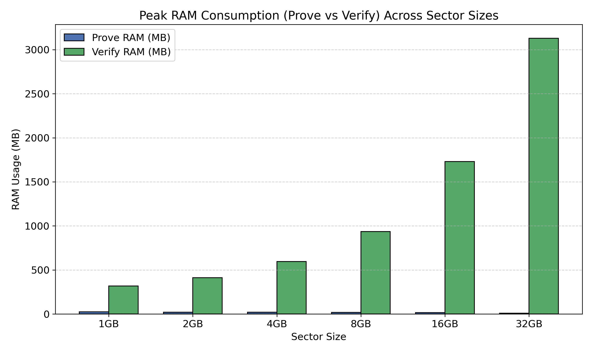
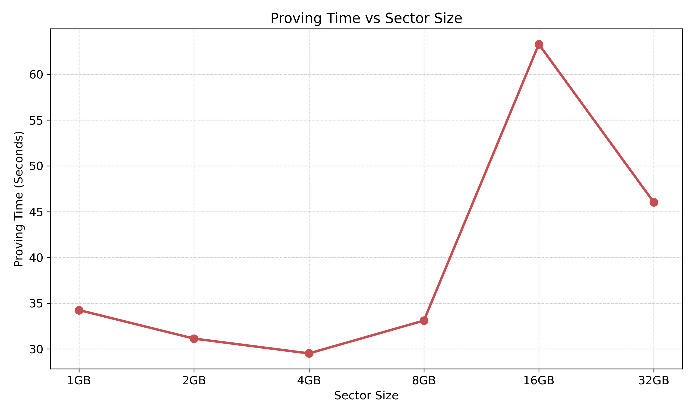
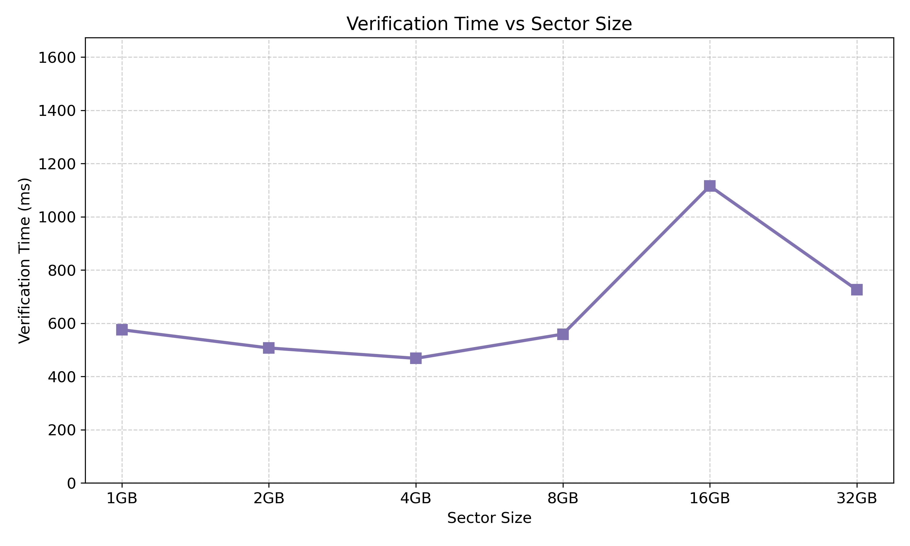
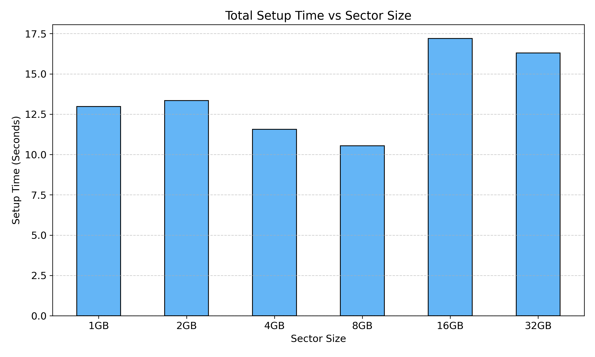
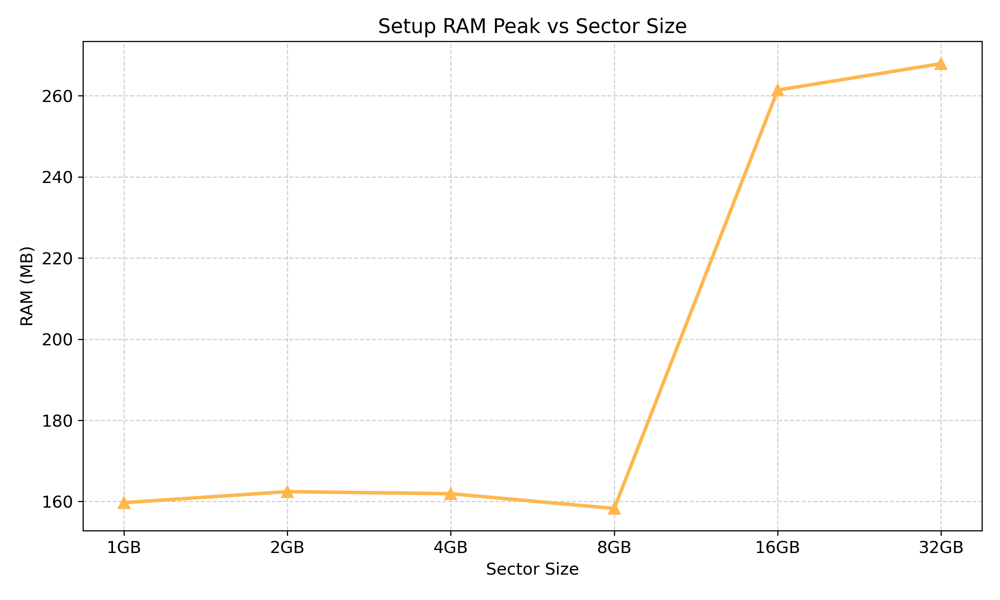
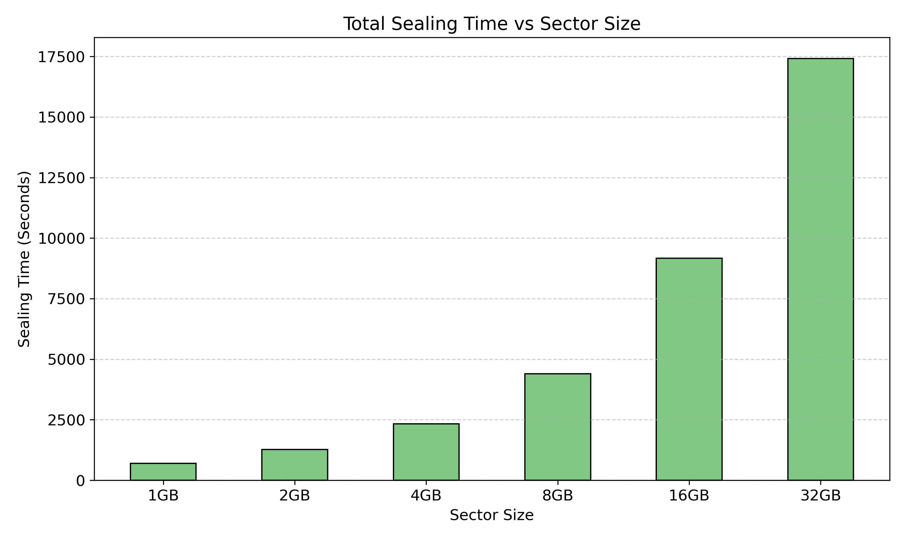
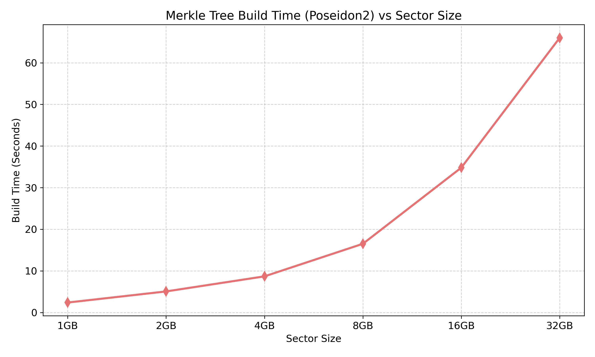

# BÁO CÁO THỐNG KÊ KẾT QUẢ BENCHMARK IF-POST

## 1. Giải thích ý nghĩa từng trường dữ liệu đo lường

*   **Thời gian Setup (`Setup_PublicParams_ms`, `Setup_PkVk_ms`):** Thời gian thiết lập ban đầu cho hệ thống mật mã. Quá trình này tạo ra các tham số công khai (Public Parameters) và cặp khóa Proving Key / Verification Key cho mạng. Thường chỉ chạy 1 lần.
*   **Thời gian Sealing (`Seal_..._ms`):** Thời gian cần thiết để "đóng gói" dữ liệu gốc thành Sector. Bao gồm việc băm dữ liệu qua Poseidon2, tính toán Merkle Tree để xây dựng gốc `sealed_root`.
*   **Thời gian Build Tree (`Seal_C_merkle_build_ms`):** Một phần của Sealing, đo lường thời gian riêng biệt chỉ để dựng cây Merkle bằng hàm băm Poseidon2 từ các lá (leaf nodes) lên tới đỉnh (root node).
*   **Thời gian Proving (`C_augmented_nova_ms`):** Đo tổng thời gian Prover (thợ mỏ) chạy thuật toán Nova Folding để tổng hợp bằng chứng không tri thức (ZK-Proof) cho tất cả các "challenges" (thử thách) được yêu cầu trong Epoch.
*   **Thời gian Verifying (`verify_time_ms`):** Đo thời gian Verifier (có thể là Node xác thực hoặc Smart Contract trên Blockchain) kiểm tra xem bằng chứng ZK có hợp lệ hay không. Con số này cần nhỏ (dưới 1s) để tối ưu chi phí Gas.
*   **RAM Peak (`Prove_RAM_peak_KiB`, `Verify_RAM_peak_KiB`):** Mức RAM tối đa tiêu thụ trong quá trình chạy. Nhờ có Nova IVC, biểu đồ RAM này sẽ giữ ở mức ổn định thay vì tăng vọt như các chuẩn SNARK cũ.

---

## 2. Biểu đồ RAM peak tiêu thụ của các Sector Size
(Gộp chung quá trình Prove và Verify để đối chiếu. Rất dễ quan sát RAM Prove cực nhỏ so với Verify nhờ Folding)

## 3. Thời gian Proving của các Sector Size
Biểu đồ đường thể hiện sự tăng trưởng tuyến tính nhưng ở mức rất thấp về thời gian của Prover (Thợ mỏ).

## 4. Thời gian Verifying của các Sector Size
Minh chứng cho việc Verify là hằng số hoặc tốn cực kỳ ít thời gian, thích hợp cho xác thực On-chain qua Smart Contract.

## 5. Xác suất phát hiện gian lận (Fraud Detection Probability)
Kết quả chạy thử nghiệm hệ thống (Run ID lặp lại nhiều lần) đối với các kịch bản bị xóa/mất dữ liệu (Gian lận/Drop Attack).
*(Hệ thống trả về Invalid đồng nghĩa với việc Giao thức phát hiện thành công dữ liệu bị thiếu và chặn gian lận).*

| Kịch bản tấn công (Scenario) | Tổng số lượt thử nghiệm | Số lần chặn đứng gian lận | Xác suất phát hiện (%) |
|---|---|---|---|
| KB1a_DropRaw_1pct_Random | 1005 | 976 | 97.11 |
| KB1b_DropRaw_5pct_Random | 1005 | 1004 | 99.9 |
| KB1c_DropRaw_10pct_Random | 1005 | 1005 | 100.0 |
| KB1d_DropRaw_OneChallenge | 1005 | 1005 | 100.0 |
| KB2_DropRaw_AtChallenge | 1005 | 1005 | 100.0 |
| KB3_DropState_AtChallengePrev | 1005 | 1005 | 100.0 |
| KB4_OldProof_NewEpoch | 1005 | 1005 | 100.0 |

## 6. Thời gian Setup của các Sector Size

## 7. RAM Setup của các Sector Size

## 8. Thời gian Sealing tổng cộng của các Sector Size

## 9. Thời gian Build Merkle Tree bằng Poseidon2

